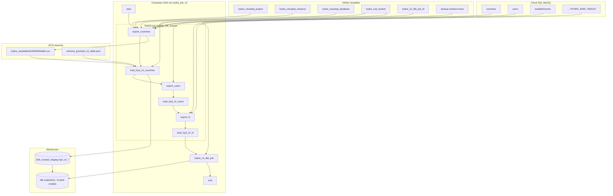

# Architecture: Hydra Cloud SQL weekly full export

Composer walks `HYDRA_RAW_TABLES` in order. Each table gets a Cloud
SQL Admin CSV export into the raw bucket, then a GCS→BigQuery load
into `dwh_trusted_staging.hyd_v2_<table>` with WRITE_TRUNCATE. After
the last load succeeds, one dbt Cloud job builds `tag:hydra_v2`.

## Diagram

## Components

**cloudsql_export_operator.py**  
`CloudSqlExportOperatorWithRetry` wraps the contrib Cloud SQL export
operator and retries HTTP 409 `operationInProgress` with linear
backoff (`delay * attempt`).  
`CloudSqlExportOperatorWithScheduleAware` doubles that delay when UTC
hour falls in a configured backup window so dumps do not thrash
against automated backups.

**hydra_export_queries.py**  
Table catalog (`HydraRawTable` + `ColumnSpec`), CSV-safe SELECT
generation (`bit` → CAST UNSIGNED, string NULL/quote/newline fixes),
MySQL→BQ load type map, schema JSON writer, and thin dbt staging /
snapshot generators. Sensitive and OAuth table key sets are asserted
out of the active catalog.

**dag_hydra_v2.py**  
Builds the sequential export→load chain inside a TaskGroup, then
fans into dbt. Missing dbt provider or job Variable renders an
EmptyOperator so the reference DAG still imports.

## Design notes

Exports are **serial by design**. Parallelizing Cloud SQL Admin
exports on one instance is how you recreate the 409 storm this
operator exists to absorb.

Historization is **not** in the export. Staging is a full replace;
dbt snapshots own unique keys (MySQL PK, or all columns when no PK).
That keeps the DAG dumb and the warehouse smart.
