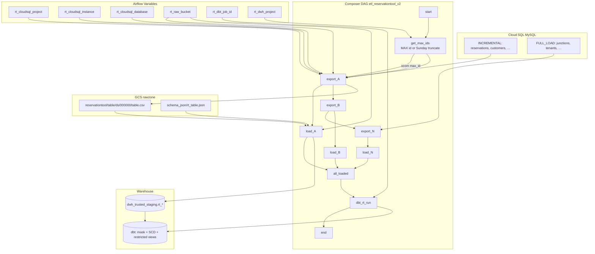

# Architecture: Reservation Tool incremental Cloud SQL export

Composer reads high-water marks from BigQuery staging, exports each
MySQL table serially through Cloud SQL Admin, loads CSV into
`dwh_trusted_staging.rt_*`, then runs one dbt Cloud job. Incremental
tables APPEND; full-load tables TRUNCATE. Sunday forces a full
baseline for the incremental set.

## Diagram



## Components

**rt_table_config.py**  
Splits the catalog into `INCREMENTAL_TABLES` and `FULL_LOAD_TABLES`,
builds CSV-safe SELECTs (`IFNULL`, CAST UNSIGNED for bit flags,
newline/quote sanitisation for free text), and keeps credential
columns in `EXCLUDE_COLUMNS` out of the export list.

**cloudsql_export_operator.py**  
`CloudSqlExportOperatorWithRetry` retries HTTP 409
`operationInProgress` with linear backoff.  
`CloudSqlExportOperatorWithScheduleAware` doubles that delay inside
a configured UTC backup window. Same family as pattern 39.

**dag_reservationtool_v2.py**  
`get_max_ids` pushes per-table watermarks (or Sunday truncate +
`max_id=0`). Builds the serial export chain with parallel loads,
gates on `all_loaded`, then runs dbt (or an EmptyOperator stub when
the job Variable / provider is missing).

## Design notes

Exports are **serial by design**. Parallelizing Cloud SQL Admin
exports on one instance recreates the 409 storm the operator exists
to absorb. Loads are the only fan-out.

Historization is **not** in the export. Daily APPEND assumes
auto_increment growth; Sunday TRUNCATE+reload plus dbt snapshots
cover deletes and late corrections. That is the opposite tradeoff
from Hydra (always full) and from Offer Tool SCD (merge in-DAG).

Jinja in the export `selectQuery` pulls the XCom watermark:

```text
… WHERE id > {{ (ti.xcom_pull(task_ids='get_max_ids', key='<table>_max_id') or 0) | int }}
```

so the operator body stays templated without a custom render hook.
