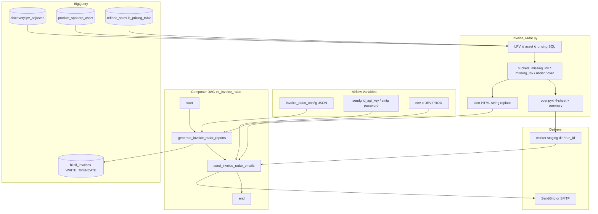

# Architecture: Invoice Radar

Composer owns the graph. `invoice_radar.py` owns the SQL, bucketing,
Excel, and HTML. `email_delivery.py` owns transport. Airflow Variables
are mapped into environment variables before the report module runs
so the notebook-shaped entrypoint stays runnable locally.

## Diagram

## Components

**config.py**  
Reads `invoice_radar_config`, resolves fully-qualified table names,
writes `BQ_*` / `EMAIL_*` / `SMTP_*` into `os.environ`. DEV overwrites
recipients.

**report_generator.py**  
Resolves the report package (Composer sync path, else this folder),
importlib-loads `invoice_radar.py`, stages under a per-`run_id`
directory, returns the email payload list for XCom.

**invoice_radar.py**  
Builds the D-3 date window, runs the reconciliation SQL (REST row
iterator — avoids BigQuery Storage API on Composer), enriches
zero-LPV reasons, optional truncate load, bucket masks, Excel,
HTML.

**email_tasks.py + email_delivery.py**  
XCom pull → `EmailMessage` → SendGrid API or SMTP with TLS.
Attachment is the staged `.xlsx` path.

## Design notes

Dynamic import keeps the notebook entrypoint (`generate_reports`)
callable without packaging it as an Airflow plugin. The cost is a
path convention: Composer must sync `invoice_radar.py` next to the
HTML template.

String-replace HTML is deliberately dumb. Nested loops and
conditionals stay in Python when we need them; the template only
receives pre-aggregated counters.
