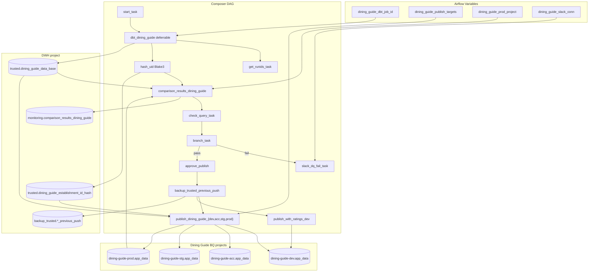

# Architecture: Dining Guide DQ-gated publish

Composer owns the graph. `dining_guide_validation.py` owns Blake3
hashing, comparison SQL, and the fail-closed gate. Destination
projects are JSON in Airflow Variables so the same DAG definition
runs on Composer-dev (single target) and Composer-prod (four envs).

## Diagram

## Components

**dag_dining_guide_dq_gated_publish.py**  
Schedule, dbt operator, branch, backup, and per-env
`BigQueryInsertJobOperator` fan-out. `max_active_runs=1` so a long
dbt+validate cycle cannot overlap the next day.

**dining_guide_validation.py**  
`UidShortener`, hash reload, comparison SQL builder, `any_flag_true`
(fail closed), branch helper, publish SELECT shape.

**sql/dining_guide_with_ratings.sql**  
Stub for the dev-only ratings-enriched table. Production substitutes a
large self-contained establishment query; the stub preserves the load
path without shipping proprietary SQL.

## Design notes

- Comparison always reads **yesterday's prod app project**, not the
  DWH backup. That is the user-visible contract.
- `hash_uid` uses `TriggerRule.ALL_DONE` so run-id tracking failures
  do not block the gate (same as production).
- Env loads stay sequential after backup in this reference; they are
  independent and can be parallelized when runtime matters.
