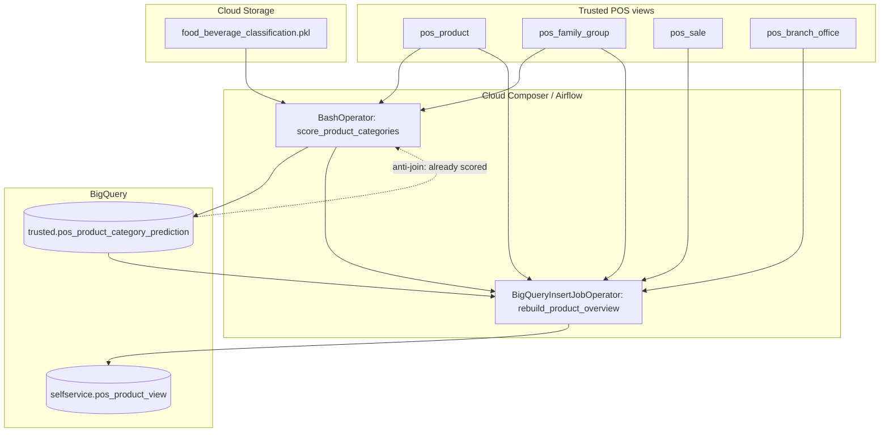

# Architecture: POS product category prediction

Batch scoring on Composer: BigQuery supplies unscored names, a sklearn
model lives in GCS, predictions land back in BigQuery, then a SQL job
rebuilds the analyst-facing product overview.

## Diagram

## Components

**Unscored name query**  
Builds `family_group + " " + product` and excludes anything already in the
prediction table. That string is the model feature and the join key later,
so we treat it as the natural key even though it is not a surrogate ID.

**Model artifact**  
Pickle in a landing-zone bucket. Versioning was by filename/date in the
original deployment. Workers download to a local path once per run.

**Scorer (`predict_product_category.py`)**  
Load model → predict per name → `insert_rows` in 10k chunks. Streaming
inserts were acceptable because daily volume was incremental, not a full
reload of the catalog.

**DAG**  
Two tasks: score, then rebuild overview. The overview query is the expensive
part (sales aggregates over ~2 months). Running it after scoring means new
labels show up in the same morning refresh.

## Why not Vertex / Cloud Run?

Daily batch, small feature space (product name text), model already trained
offline. A hosted endpoint would have added IAM, networking, and cold-start
noise for no latency benefit. Composer + GCS pickle was the lowest-ops path
that still versioned the artifact outside the DAG code.

## Failure / operability notes

- If GCS download fails, the Bash task fails and Airflow retries once.
- Partial BQ streaming inserts are treated as hard errors; better to retry
  the whole unscored set than leave a half-written batch with unclear
  coverage.
- Test outlets are filtered out of the overview SQL (`is_test_office = 0`)
  so demo POS data does not pollute self-service tables.
