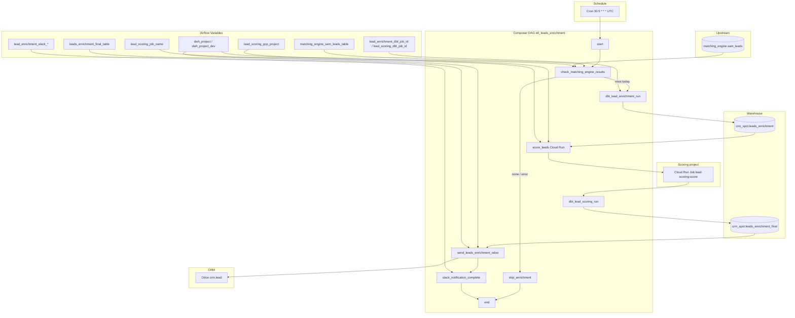

# Architecture: Lead enrichment + Cloud Run scoring

Composer owns schedule, gate, and graph. dbt Cloud owns enrichment and
post-score models. Cloud Run owns the scoring binary. Pattern 02's
Odoo lead engine owns CRM writes (stubbed here for portfolio parse).

## Diagram

## Components

**matching_engine_gate.py**  
BigQuery `COUNT(*)` for `CURRENT_DATE()` on the matching-engine leads
table. Returns `dbt_lead_enrichment_run` or `skip_enrichment`. Query
exceptions take the skip path.

**dag_lead_enrichment_scoring.py**  
Branch + linear enrichment chain. Cloud Run Execute Job with CLI args
`(product, market, env, logical_date, mode, dry_run)`. dbt and Cloud
Run tasks become EmptyOperators when providers / job-id Variables are
missing so the reference checkout still imports.

**odoo_enrichment_push.py**  
Thin adapter. Production wires pattern 02
`load_data_leads_enrichment` (country/lang/channel refs, product codes,
address hash). Do not duplicate that mapper here.

## Design notes

Cloud Run `overrides.container_overrides[].args` is how product/market
and the logical date reach the scoring image without rebuilding. Keep
the arg order stable; the image CLI is the contract.

Gate task_ids must match BranchPythonOperator return values exactly
(`dbt_lead_enrichment_run`, `skip_enrichment`). Renaming a dbt task
without updating the gate module breaks the branch silently into a
missing downstream.
