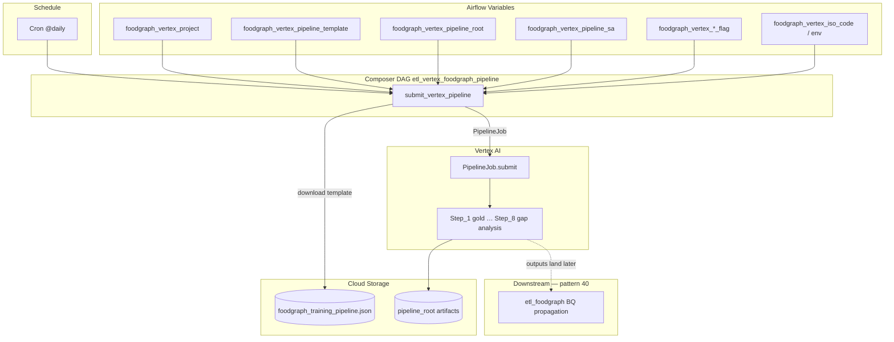

# Architecture: Food Graph Vertex PipelineJob

Composer owns schedule, Variables, and submit. Vertex AI owns pipeline
runtime. GCS holds the compiled KFP template. Pattern 40 (separate DAG)
lands outputs after the pipeline writes BigQuery tables.

## Diagram

## Components

**dag_vertex_pipeline.py**  
Builds `op_kwargs` from Variables and the GCP connection extra, then
runs a single `PythonOperator`. `max_active_runs=1`.

**vertex_pipeline_scheduler.py**  
Downloads the template, constructs `aiplatform.PipelineJob` with
`parameter_values` mapped from step flags, calls `submit()`.

**gcs_utils.py**  
Connection-aware GCS client. Accepts key_path or keyfile_dict; falls
back to ADC. Never logs secret material.

## Boundaries

| Concern | Owner |
|---------|-------|
| Schedule + flag matrix | Composer Variables |
| Compiled pipeline graph | GCS template (ML team) |
| Step runtime / GPU / caching | Vertex AI |
| Landing BQ gold / REX copies | Pattern 40 |
| Lead scoring Cloud Run | Pattern 44 |
