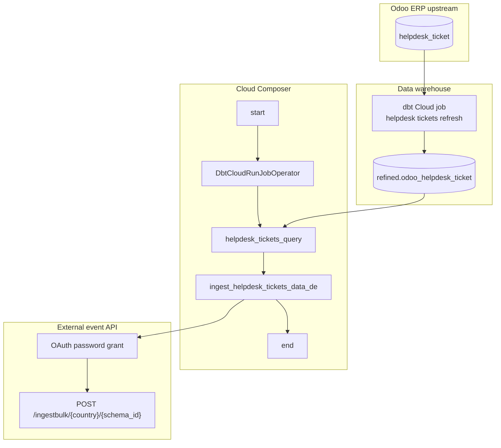

# Architecture: Odoo helpdesk tickets daily event export

Three pieces: a dbt Cloud refresh of the refined helpdesk model, a SQL
builder that selects yesterday's creates, and an Avro bulk client that
talks to the external event API. Linear chain — no hist table, no
hash-delta.

## Diagram

## Components

**dbt Cloud job**  
Rebuilds `refined.odoo_helpdesk_ticket` before export. Job id comes from
an Airflow Variable so DEV/PROD do not fork the DAG file. Timeout 300s —
enough for this model when it shipped; raise if the job starts timing out
rather than silently shortening the refresh.

**get_helpdesk_tickets_send_query**  
Selects 13 outbound fields, casts dates to STRING for the Avro string
contract, filters `ticket_number IS NOT NULL` and
`DATE(create_date) = CURRENT_DATE() - 1`. Incremental by calendar day,
not by hash.

**send_helpdesk_tickets_data**  
BQ client → Avro encode (schema parsed once) → chunk 500 → bulk POST.
OAuth client refreshes once on 401 so a slow night does not die mid-chunk.

**DAG ordering**  
`start → dbt → ingest → end`. Ingest uses `all_success`, so a failed
dbt refresh does not push a stale day. There is no hist append stage —
re-runs for the same calendar day can re-post the same creates; the
consumer should tolerate duplicates or you clear the failed ingest task
only.

## Why date-delta and not hash-delta?

The SFDC asset and scoring exports needed hash compare because the
outbound payload mutates (status flips, score recalcs) and consumers
hated full reloads. Helpdesk Level-1 opens for this consumer are
create-oriented: "tickets opened yesterday." A create_date filter is
cheaper to operate and easier to explain on-call. If a later consumer
needs status-change events, add a write_date slice or a hist table —
do not overload this DAG.
