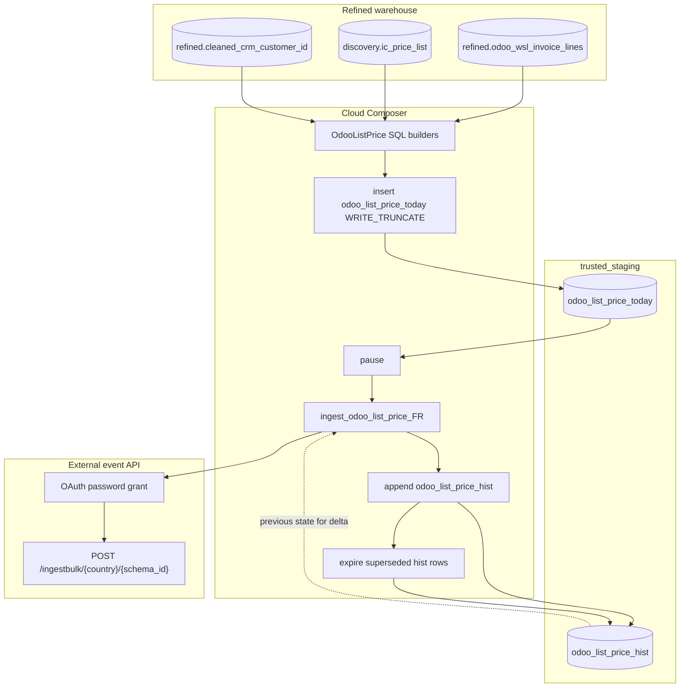

# Architecture: Odoo list-price / commission monthly delta export

Three layers: SQL builders that snapshot invoice × list-price rows and
compute hashes, a Composer DAG that truncates today / ingests / maintains
history, and an Avro bulk client that talks to the external event API.

## Diagram

## Components

**OdooListPrice**  
Static builders for the today INSERT, hist APPEND delta, expire UPDATE, and
send SELECT. `_keyhash` identities the parent bill + establishment pair;
`_rowhash` fingerprints the outbound commission payload (amounts, product
codes, promo splits). New key or changed row → outbound event.

Production insert SQL had many more CTEs (reversed-line exclusion,
multi-country agency filters, SFDC subscription history, discount/credit
splits). The sanitized builder keeps the join skeleton + hash mechanics;
expand CTEs when you need the full finance ruleset.

**send_odoo_list_price_data**  
BQ client → Avro encode (including logical date fields) → chunk 500 → bulk
POST. OAuth client refreshes once on 401 so a slow month-start does not die
mid-chunk. Schema is parsed once outside the row loop.

**DAG ordering**  
`today` truncate → ingest (against *previous* hist) → hist append → hist
expire. That order is load-bearing. Same failure mode as SFDC asset /
scoring: flip hist before ingest and you ship silence.

## Why hash-delta and monthly?

Full monthly reload was fine at pilot volume. Once partner consumers started
reprocessing unchanged bills, API quota and finance support noise grew.
Hash compare against last run's hist cut payload size on quiet months
without standing up Odoo CDC. Monthly cadence matches how commission
settlement actually works; daily would mostly re-hash static rows.
