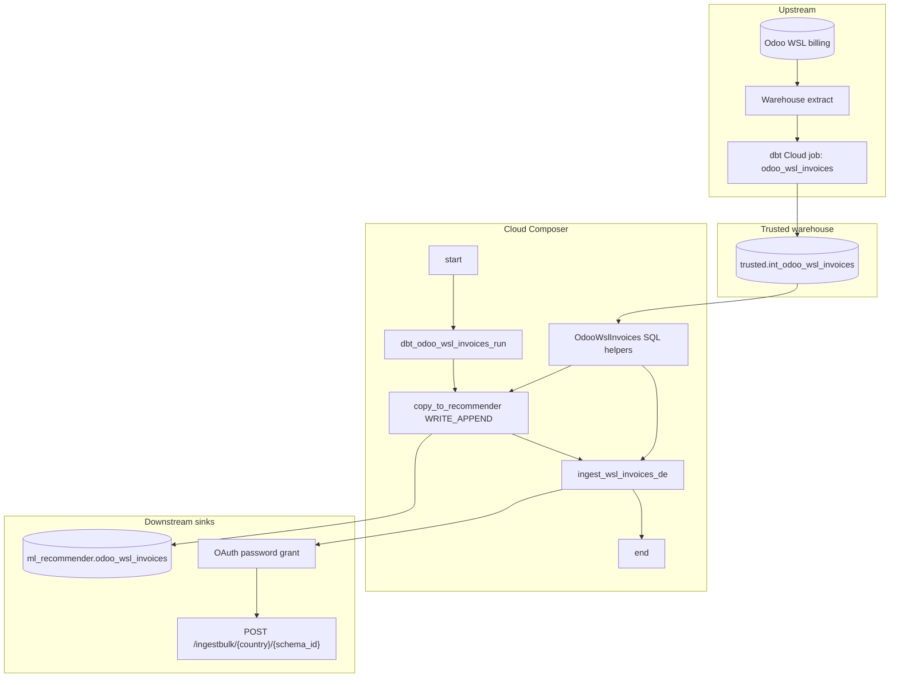

# Architecture: Odoo WSL invoices dual export

Three layers: a SQL helper that keeps the trusted SELECT shared, a Composer
DAG that sequences dbt → recommender APPEND → event ingest, and an Avro
bulk client for the external event API.

## Diagram

## Components

**OdooWslInvoices**  
Static builders for the send SELECT and the recommender copy SELECT. Same
filter on purpose — if the event bus and the ML table disagree on which
rows are "valid", every recommender incident becomes a schema debate.

**send_wsl_invoices_data**  
BQ client → Avro encode (logical date fields) → chunk 500 → bulk POST.
OAuth client refreshes once on 401. Schema is parsed once outside the row
loop (production parsed every row). The recurring-revenue field mapping
bug from source is corrected here.

**DAG ordering**  
dbt refresh → recommender APPEND → event ingest. Linear on purpose. dbt
must land before both readers. Recommender before ingest so a flaky API
does not also block the ML history write for the day — ingest can retry
alone.

## Why dual sink in one DAG?

Splitting into two DAGs with an ExternalTaskSensor looks cleaner on a
whiteboard and fails messier in ops: two schedules, two failure emails,
two people checking whether dbt actually ran. One chain keeps the
contract explicit: trusted table fresh → both consumers fed from the
same SELECT.
