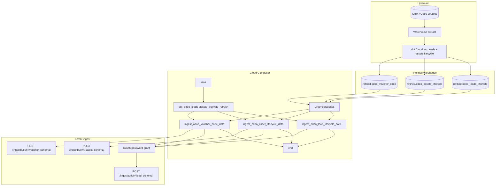

# Architecture: Odoo / CRM assets + leads lifecycle export

One dbt refresh, three parallel Avro ingest paths, one pilot market.
SQL helpers keep the SCD / created-date filters out of the DAG body;
the export module owns OAuth + Avro + chunked POST.

## Diagram

## Components

**LifecycleQueries**  
Three static SELECT builders. Leads and assets filter on SCD validity
(`_valid_flag`, `_valid_from >= CURRENT_DATE()`). Vouchers filter on
`asset_created_date >= CURRENT_DATE() - 1`. Country is uppercased in
SQL; the ingest path keeps the lowercase market code the API expects.

**send_*_data**  
BQ client → Avro encode → chunk 500 → bulk POST. One OAuth client per
send task (tasks run in parallel — sharing a module-level token across
tasks is a race). Schema parsed once per send (production parsed every
row). HTTP errors raise; production only logged the response body.

**DAG ordering**  
`start → dbt → {lead, asset, voucher} → end`. Fan-out after dbt is the
point: one refresh contract, three independent ingest failure domains.
A flaky voucher API does not block lead delivery for the day.

## Why not three DAGs?

The dbt job is the shared critical path. Three sensors on the same job
id create three places to misconfigure schedule overlap and three
places to get "dbt succeeded but my DAG didn't see it" tickets. One
DAG makes the contract obvious in the graph.
