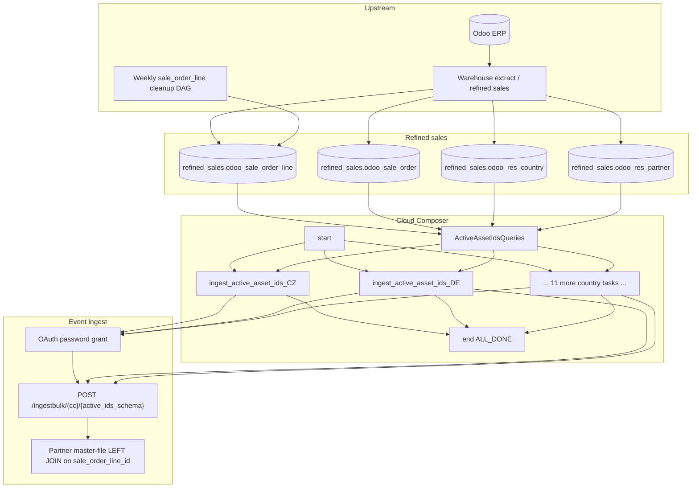

# Architecture: weekly active asset ID snapshot

One refined-sales SELECT per country, thirteen parallel Avro ingest
paths, no dbt. Query helpers keep country filters out of the DAG body;
the export module owns OAuth + Avro + chunked POST.

## Diagram

## Components

**ActiveAssetIdsQueries**  
One static SELECT: DISTINCT active line id, parent order id,
establishment UUID, snapshot date. Country filter via
`odoo_res_country.code`. No SCD columns — presence is the contract.

**send_active_asset_ids_data**  
BQ client → Avro encode → chunk 500 → bulk POST. One OAuth client per
country task (tasks run in parallel). Schema parsed once per send
(production parsed every row). HTTP errors raise; production only
logged the response body.

**DAG ordering**  
`start → {13 country tasks} → end(ALL_DONE)`. No dbt. Fan-out is the
point: markets fail independently. `ALL_DONE` closes the run even when
a subset fails — useful for ops visibility, dangerous if you only
watch DAG state.

## Why not fold into pattern 09?

Different cadence (weekly vs twice-daily), different semantics
(presence vs SCD delta), different failure cost. A flaky Sunday DE
export should not block Monday morning FR lead deltas. Separate DAGs
keep the graphs honest.
