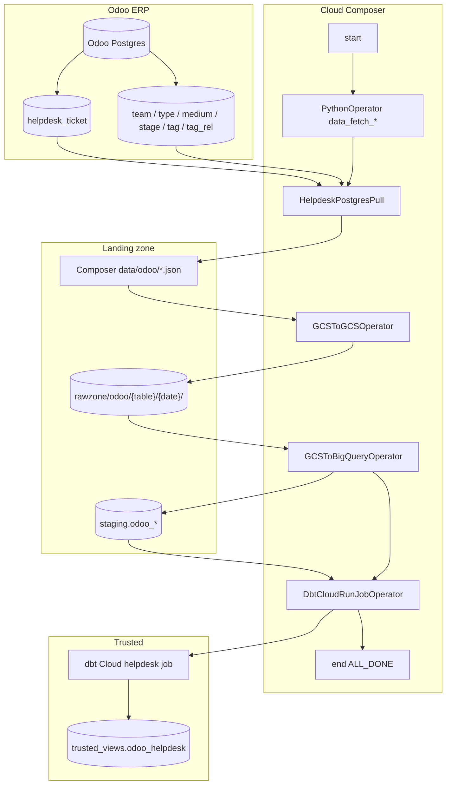

# Architecture: Odoo helpdesk Postgres pull

Four stages: Postgres extract → Composer data file → raw GCS → BigQuery
staging, then one dbt Cloud job. Dimension tables and the ticket delta
share the same operator triple so ops only learn one shape.

## Diagram

## Components

**HelpdeskPostgresPull**  
One class, one method per entity. Tickets and optional mail messages
filter on create/write in {today, yesterday}. Dims are full SELECT *.
Credentials from `odoo_dm_creds` / `odoo_prod_creds`. Lazy connect;
each method closes the handle so a failed table does not leave a
zombie session for the next worker.

**Operator triple per table**  
`data_fetch_*` → `upload_storage_*` → `load_staging_*`. Source chained
these sequentially across the whole table list. Staging write is
WRITE_TRUNCATE; schema JSON lives in the raw bucket under
`schema_json/odoo_{table}.json`.

**dbt Cloud job**  
Job id from Variable `dbt_odoo_helpdesk_job_id`. Runs once after all
staging loads. Timeout 300s — raise it if the job grows, do not shorten
the refresh silently.

**HelpdeskRowCountChecks** (optional helper)  
Side-by-side create/update counts from Odoo Postgres and the trusted
warehouse view. Useful for Slack summaries; not wired as a hard gate
in the source DAG.

## Why Postgres and not OdooRPC?

Bulk helpdesk extracts with wide column lists and date filters are
awkward over XML-RPC and slow under concurrent Composer tasks. Direct
Postgres (SSL) is the same tradeoff we used across the Odoo migration
read paths: RPC for writes that must fire business logic, SQL for
warehouse extracts. Pattern 06 never sees Postgres — it reads what
this landing path + dbt already cleaned.
