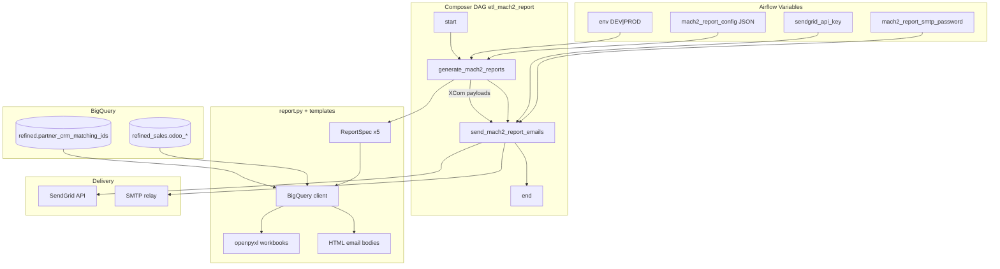

# Architecture: Mach2 Odoo sales email report

Composer owns the graph. `report.py` owns BigQuery SQL, Excel bytes,
and HTML payload construction. `email_delivery.py` owns SendGrid /
SMTP. Airflow Variables own table names and audiences; secrets never
sit in the JSON config blob.

## Diagram

## Components

**report.py**  
Builds five `ReportSpec`s (sales channels, activation add-ons,
cancellation add-ons, POS cancellation, POS activation). Each spec
owns SQL, sheet name, recipient env key, and HTML builder. Queries
run against refined Odoo tables plus a partner CRM matching table.
Excel gets a frozen header and alternating row fill; empty frames
skip the attachment but still produce HTML.

**report_generator.py**  
Resolves the report module from the Composer sync path, falling back
to the portfolio folder next to this file. Stages under a sanitized
`run_id` directory so concurrent manual runs do not clobber files.

**config.py**  
Maps `mach2_report_config` into process env. DEV overwrites all three
audience lists with `DEV_TEST_RECIPIENTS` and clears CC.

**email_tasks.py / email_delivery.py**  
XCom → `EmailMessage` → SendGrid or SMTP. Per-report try/except so
one bad address does not block the other four.

## Design notes

Generate and send are separate on purpose. Re-running five BQ jobs
because SendGrid returned 429 is how you burn slot time and confuse
ops with duplicate Excel timestamps. XCom carries paths and HTML;
retries only re-send.

Fiscal UUID defaults for FR vs other markets are hardcoded
placeholders in this sample. In production they were environment
constants — treat them as config if you fork the pattern, not as
magic strings buried in SQL.
