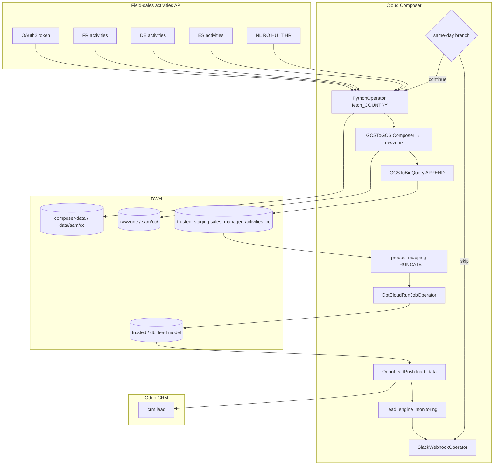

# Architecture: Field-sales activities → Odoo

Composer DAG that fans out eight country fetches against a field-sales
activities API, lands NDJSON on GCS, appends BigQuery staging, runs
dbt, then pushes leads to Odoo CRM with a count monitor.

## Diagram

## Components

**API client (`sam_activities_api.py`)**  
OAuth2 password grant, Bearer refresh on 401, paginated
`v1/countries/{cc}/activities` with category/status filters, row
normalize (objectives flattened, `load_date` from `lastModified`),
NDJSON write. Retries with sleep between attempts.

**Odoo adapter (`odoo_lead_push.py`)**  
Thin contract for `load_data` / `lead_engine_monitoring`. Production
wires the pattern 02 lead-engine class here so this folder stays a
focused orchestration sample.

**DAG (`dag_sales_manager_activities.py`)**  
Same-day `BranchPythonOperator`, per-country fetch → copy → stage
chain into a join, product-mapping reload, optional dbt Cloud job,
Odoo push, monitor, Slack. `max_active_runs=1`.

## Failure modes

| Mode | Behaviour |
|------|-----------|
| Same-day re-queue | Branch → `skip_pipeline` → end |
| OAuth / 401 mid-run | Client refreshes token and retries page |
| Empty country | Zero-row NDJSON; APPEND still runs; dbt sees no new rows |
| Missing dbt job id | EmptyOperator skip; Odoo push still runs on last model |
| Count mismatch | Monitor returns non-MATCH; Slack failure message |
| Bad activity row | Logged and skipped; page continues |
