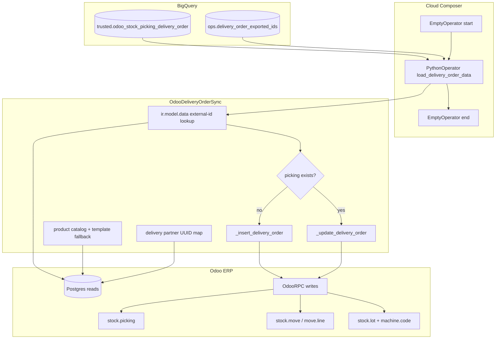

# Architecture: Delivery order reverse ETL

Composer runs a single Python task that reads a trusted BigQuery delivery
table, resolves Odoo IDs over Postgres, and creates or updates
`stock.picking` through OdooRPC.

## Diagram

## Components

**DAG (`dag_delivery_order.py`)**  
Env-aware project + Odoo creds from Airflow Variables. Builds the
ranked delivery query (exclude already-exported external ids). One
`PythonOperator` with a one-hour execution timeout. `max_active_runs=1`.
Schedule left `None` — install waves were triggered manually.

**Sync class (`odoo_delivery_order.py`)**  
Dual connection: OdooRPC for create/write/validate, Postgres for
partner / product / lot / external-id lookups. Insert path builds
moves, enables serial tracking when serials exist, registers
`ir.model.data`, sets state to `waiting`, then optionally `done`.
Update path drafts existing moves, rebuilds duplicates, refreshes
header fields, and short-circuits validated pickings to fulfilment /
sale-order link only.

**Connection stub (`odoo_connection.py`)**  
Minimal OdooRPC login. Production should wire pattern 05.

## Failure modes

| Mode | Behaviour |
|------|-----------|
| Odoo / HTTP timeout | Single 60s retry via `retry_on_timeout` (sale-order lookup waits 300s) |
| Missing partner UUID | Log + continue with `partner_id=None` where Odoo allows |
| Missing product code | Skip line; Package codes skipped on multi-line deliveries |
| Stock availability error on lot write | Append carrier ref to exception list; abort that picking |
| Already-validated picking | Header / fulfilment refresh only; no move rebuild |
| Empty BQ result | Early return; DAG succeeds |
