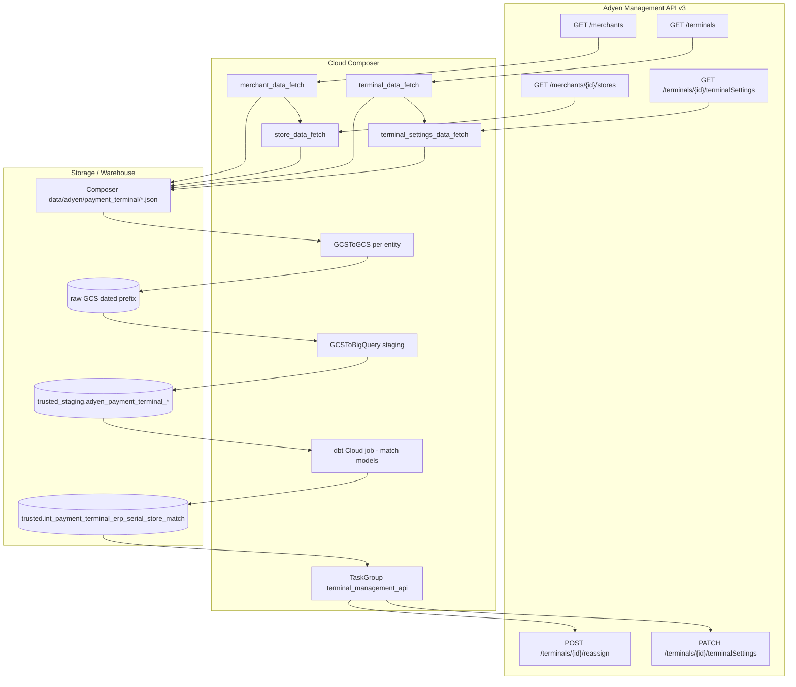

# Architecture: Adyen payment terminal integration

Two halves in one DAG: a read path that materializes Adyen Management API
entities into BigQuery staging, and a write path that reassigns / patches
terminals using a dbt-built match table.

## Diagram

## Components

**AdyenConfig / AdyenManagementClient**  
API key + Basic auth headers, environment-specific base URL
(`management-{test|live}.adyen.com/v3`). One client shared by endpoint helpers.

**Endpoint classes**  
Merchants, stores, terminals, terminal settings, terminal reassign. Each
normalizes the Adyen payload into flat dicts we can JSONL and load without
nested schema pain in staging.

**Extract callables**  
`fetch_*_and_save` write JSONL under the Composer data directory. Merchants
feed stores via XCom. Terminals feed settings. Inventory-assigned terminals
are skipped on settings GET.

**Landing + load**  
Copy Composer objects into the raw zone under a date partition, then
`WRITE_TRUNCATE` into staging tables using schema JSON from the same bucket.

**dbt step**  
Builds the serial↔store match (and related flags like
`to_disable_standalone_tip`). The portfolio DAG stubs the custom Composer
dbt operator; production used `DbtCloudRunJobOperator` with a fixed job id.

**terminal_management_api TaskGroup**  
1. Reassign from BQ rows (`terminal_id`, `store_id`)
2. PATCH default lite settings for flagged terminals (`ALL_DONE` after reassign)

## Why Management API and not webhooks?

We needed a full inventory snapshot for analytics and a deterministic write
path driven by warehouse logic. Webhooks are great for event-driven updates;
they are a poor fit when dbt decides *which* terminals to move after joining
ERP serials. Nightly pull + targeted POST/PATCH kept the control plane in
one place.
