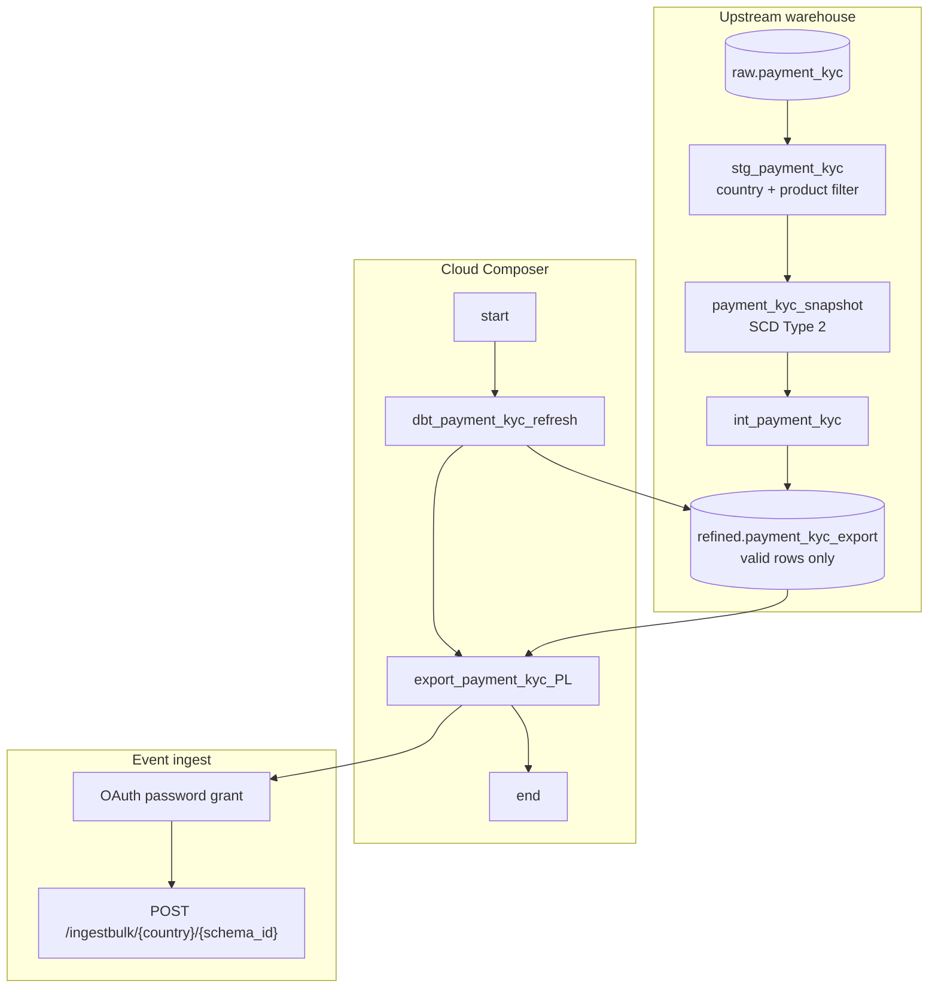

# Architecture: Payment KYC export to partner event bus

dbt owns historisation and scope. The DAG owns order. The export
module owns OAuth + Avro + chunked POST.

## Diagram

## Components

**dbt Cloud job (`dbt_payment_kyc_refresh`)**  
Four-model chain: staging filter (country + payment product) → SCD2
snapshot → intermediate reshape → refined export of current valid
rows. Job id from Airflow Variable `dbt_job_payment_kyc_export`.
Timeout 600s — KYC volume for one market is small; the wait is
usually snapshot merge cost, not row count.

**kyc_query**  
Thin SELECT over `refined.payment_kyc_export`. Formats timestamps /
dates as strings for the Avro contract. No WHERE clause for country
or product — that filter already ran in staging. If the refined table
is wrong, fix dbt, do not paper over it in the export SQL.

**kyc_export**  
BQ SELECT → Avro encode → chunk 500 → bulk POST. Schema parsed once
per send. HTTP errors raise; 401 clears the token and retries with
the same payload.

**DAG ordering**  
`start → dbt → export_payment_kyc_{CC} → end`. Export only runs after
dbt succeeds (`all_success`). Production left `start` visually
orphaned from the export edge; the sanitized DAG uses `chain` so the
graph matches the contract.

## Why dbt before ingest?

The partner feed is a *current* snapshot. Without the SCD2 refresh,
you re-ship yesterday's valid rows and miss status flips that landed
overnight. Separating dbt into another DAG works only if you add an
external sensor and accept a longer SLA — for a 06:00 daily slot,
one chain is simpler to operate.
