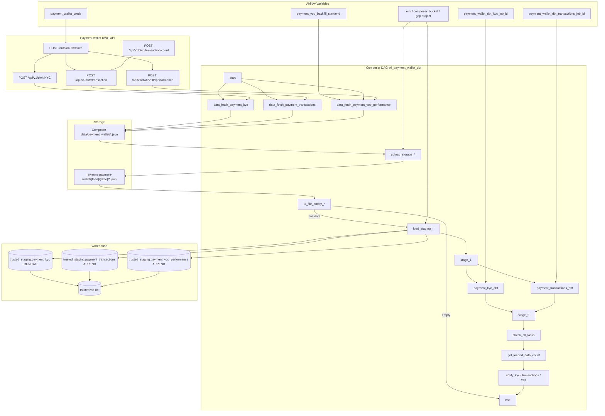

# Architecture: Payment wallet API ingest

Composer owns the graph. `payment_api.py` owns OAuth, pagination, and
NDJSON write. Stock GCS / BigQuery operators move bytes. Two dbt Cloud
jobs own trusted models after staging lands (VOP models share the KYC
job tag).

## Diagram

## Components

**payment_api.py**  
`PaymentWalletAPI` handles token fetch, 401/403 refresh, and three
pagination styles. `get_payment_wallet_data` is the Airflow callable
that writes NDJSON and returns `{api_records_count, ...}` for XCom.
`get_loaded_data_count` queries the trusted intermediate for today's
transaction row count (ops reconciliation).

**dag_dishpay_api_ingest.py**  
Fan-out loop over three feeds with shared OAuth kwargs. Branch on empty
rawzone blob before staging load. Parallel dbt jobs after `stage_1`.
Notification tasks run `ALL_DONE` so a single feed failure still
surfaces a Slack summary.

**Staging contract**  
NDJSON lines → GCS → BigQuery single `JSON` column. KYC truncates;
transactions and VOP append. dbt owns the trusted / refined layer
(including VOP models tagged with the KYC job).

## Design notes

Three pagination contracts in one client is intentional. The wallet
API did not ship a uniform list contract; wrapping each feed in its
own DAG would triple OAuth Variable sprawl and notification noise.

Empty-file branching exists because weekends and low-volume markets
legitimately return zero rows. Failing the DAG on empty is worse than
skipping load and still running dbt for the feeds that did land —
though today `no_data_*` goes straight to `end`, so a zero-KYC day
does not block transactions dbt if that feed had data. Read the graph
carefully before changing trigger rules.
