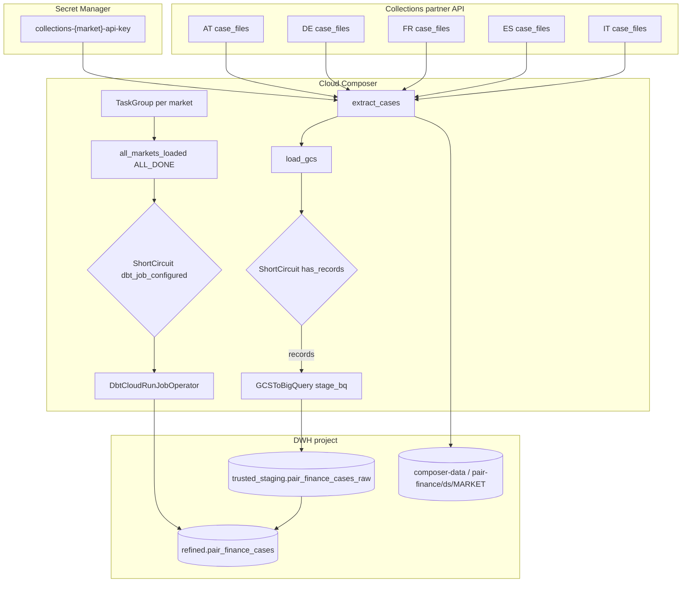

# Architecture: Collections partner case ingest

Composer DAG that fans out five market TaskGroups against a partner
collections API, lands NDJSON on the Composer bucket, loads a typed
BigQuery staging table, and optionally triggers dbt Cloud.

## Diagram

## Components

**API connector (`pair_finance_api.py`)**  
Bearer auth, paginated `list_cases` (from/amount, 500/page), optional
`get_case` detail fetch, `flatten_case` to STRING-safe rows,
`cases_to_ndjson`. Retries on 429/5xx with exponential backoff.
`MARKET_CONFIG` holds base URL and merchant per market.

**Pipeline helpers (`pair_finance_pipeline.py`)**  
`resolve_env`, Secret Manager + Variable key resolution,
`gcs_object_name`, idempotent `extract_cases`, optional GCS copy
`load_gcs`, `has_records` gate, explicit `STAGING_SCHEMA_FIELDS`,
`raw_bucket_name` (default `composer-data` in PROD).

**DAG (`dag_pair_finance_cases.py`)**  
Five TaskGroups driven by `MARKET_CONFIG` keys. `all_markets_loaded`
uses `TriggerRule.ALL_DONE` so skipped markets do not block the join.
dbt job id defaults empty; ShortCircuit skips the operator until a
Variable is set. `dbt_poll_interval` is inlined (no package import).

## Failure modes

| Mode | Behaviour |
|------|-----------|
| Missing API key | Skip extract for that market |
| Object already landed | Skip extract unless full load |
| Zero cases | `has_records` ShortCircuit skips `stage_bq` only |
| Empty dbt job id | ShortCircuit skips dbt; `end` still runs via ALL_DONE |
| Schema drift | Raw JSON retained; fix in dbt staging model |
