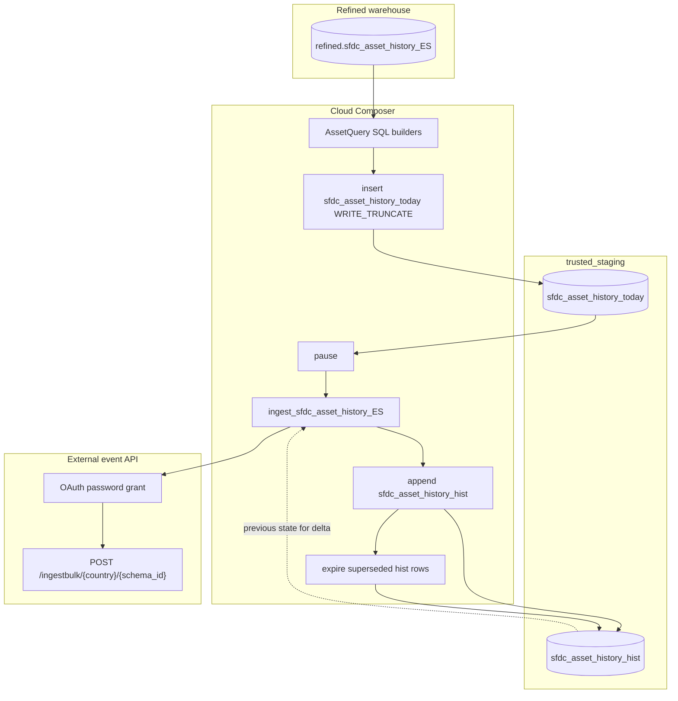

# Architecture: Salesforce asset history delta export

Three layers: SQL builders that snapshot refined SFDC assets and compute
hashes, a Composer DAG that truncates today / ingests / maintains history,
and an Avro bulk client that talks to the external event API.

## Diagram

## Components

**AssetQuery**  
Static builders for the today INSERT, hist APPEND delta, expire UPDATE, and
send SELECT. `_keyhash` identities the establishment + CRM account pair;
`_rowhash` fingerprints the outbound asset payload (product, channel,
status, dates, shipping, ids). New key or changed row → outbound event.

**send_sfdc_asset_history_data**  
BQ client → Avro encode (including logical date fields) → chunk 500 → bulk
POST. OAuth client refreshes once on 401 so a slow night does not die
mid-chunk.

**DAG ordering**  
`today` truncate → ingest (against *previous* hist) → hist append → hist
expire. That order is load-bearing. Same failure mode as the scoring export:
flip hist before ingest and you ship silence.

## Why hash-delta and not full reload?

Full daily reload to the event bus was fine at pilot volume. Once partner
consumers started reprocessing unchanged installs, API quota and support
noise grew. Hash compare against yesterday's hist cut payload size on quiet
nights without standing up Salesforce CDC. Good enough for daily asset
churn; for high-frequency status flips I would look at change-data-capture
instead of snapshot-diff.
