# Architecture: Salesforce refined daily aggregates

Composer rebuilds eight CRM-facing snapshot tables in BigQuery from
refined and trusted sources, then notifies reporting.

## Diagram

```mermaid
flowchart TB
  subgraph vars [Airflow Variables]
    PROJ["dwh_project_id"]
  end

  subgraph upstream [Upstream refined / trusted]
    ORD["refined.vw_analytical_order_orders_actual"]
    RT["trusted_views.rt_reservations"]
    RT_EST["refined.analytical_rt_establishments_actual"]
    CB["refined.customer_base_establishment"]
    SUB["trusted_views.subscription_*"]
    VOUCH["trusted.pc_vouchers*"]
    SFDC_A["trusted_views.sfdc_asset / sfdc_product"]
    ODOO["trusted_views.odoo_wsl_invoice_lines"]
    EST["refined.analytical_sfdc_establishment_actual"]
    APP["refined.app_datafeed"]
    POS["trusted.pos_payment_items_DE|FR|IT|ES"]
    LIC["product_spot.odoo_asset / odoo_establishment"]
  end

  subgraph compose [Composer DAG etl_sfdc_refined_aggregates]
    START[start]
    T_ORD[create_orders_aggregated]
    T_RES[create_reservations_aggregated]
    S1[stage_1]
    T_BILL[create_subscription_billing_info]
    T_VOUCH[create_voucher_info]
    T_ODOO[create_sfdc_odoo_export]
    T_COPY[odoo_wsl_invoice_lines_copy]
    T_APP[app_login]
    S2[stage_2]
    T_POS[pos_transactions_aggregated]
    MAIL[email]
    ENDN[end]
  end

  subgraph bq [BigQuery refined_salesforce]
    O_ORD[("orders_aggregated")]
    O_RES[("reservations_aggregated")]
    O_BILL[("subscription_billing_info")]
    O_VOUCH[("voucher_info")]
    O_SFDC[("sfdc_odoo_export")]
    O_INV[("odoo_wsl_invoice_lines")]
    O_APP[("app_login")]
    O_POS[("pos_transactions_aggregated")]
  end

  subgraph consumers [Downstream]
    CRM["Salesforce / CRM integrations"]
    RPT["Internal reporting"]
  end

  PROJ --> START
  ORD --> T_ORD
  RT --> T_RES
  RT_EST --> T_RES
  CB --> T_RES
  SUB --> T_BILL
  VOUCH --> T_VOUCH
  SFDC_A --> T_ODOO
  ODOO --> T_ODOO
  ODOO --> T_COPY
  EST --> T_ODOO
  APP --> T_APP
  POS --> T_POS
  LIC --> T_POS

  START --> T_ORD & T_RES --> S1
  S1 --> T_BILL & T_VOUCH & T_ODOO & T_COPY & T_APP --> S2
  S2 --> T_POS --> MAIL --> ENDN

  T_ORD --> O_ORD
  T_RES --> O_RES
  T_BILL --> O_BILL
  T_VOUCH --> O_VOUCH
  T_ODOO --> O_SFDC
  T_COPY --> O_INV
  T_APP --> O_APP
  T_POS --> O_POS

  O_ORD & O_RES & O_BILL & O_VOUCH & O_SFDC & O_INV & O_APP & O_POS --> CRM
  O_ORD & O_RES & O_POS --> RPT
```

## Components

**dag_sfdc_refined_aggregates.py**  
Staged fan-out of eight truncate-reload BQ jobs + completion email.
`max_active_runs=1`. Schedule `0 7 * * *`.

**sfdc_refined_queries.py**  
`SfdcRefinedQueries` static builders. Project id injected where tables
are fully qualified; a few refined views stay project-relative as in
source.

## Design notes

- Stage markers are `EmptyOperator` with `ALL_DONE` so the graph shape
  matches production even when a parallel branch fails.
- Only orders and reservations carry day partitioning in the sample
  (plus clustering on reservations). Other tables are unpartitioned
  snapshots — same as source.
- `_rowhash` on `sfdc_odoo_export` is for downstream Salesforce upsert
  logic, not for this DAG's write path.
