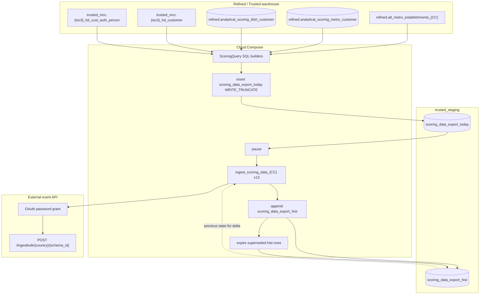

# Architecture: multi-country FBO/NBO scoring export

Three layers: SQL builders that assemble a cross-country snapshot, a Composer
DAG that truncates today / fans out ingest / maintains history, and an Avro
bulk client that talks to the external event API.

## Diagram

## Components

**ScoringQuery**  
Static builders for per-country SELECTs, the UNION ALL insert, the hist
append delta, the expire UPDATE, and the per-country send SELECT. Key idea:
`_keyhash` identities the establishment; `_rowhash` fingerprints the scored
payload. New key or changed row → outbound event.

**send_scoring_data**  
BQ client → Avro encode → chunk 500 → bulk POST. OAuth client refreshes once
on 401 so a long DE/FR loop does not die mid-run.

**DAG ordering**  
`today` truncate → parallel country ingest (against *previous* hist) → hist
append → hist expire. That order is load-bearing. A later production revision
moved the SQL into two dbt Cloud jobs for the same reason: job 1 builds today
only; job 2 updates hist *after* ingest.

## Why hash-delta and not full reload?

Full reload to the event bus was fine at pilot volume. At a dozen markets it
burned API quota and made downstream consumers reprocess unchanged rows.
Hash compare against last month's hist cut payload size dramatically on quiet
months without inventing a CDC stack. Good enough for monthly scoring; I would
not use this for high-churn transactional feeds.
