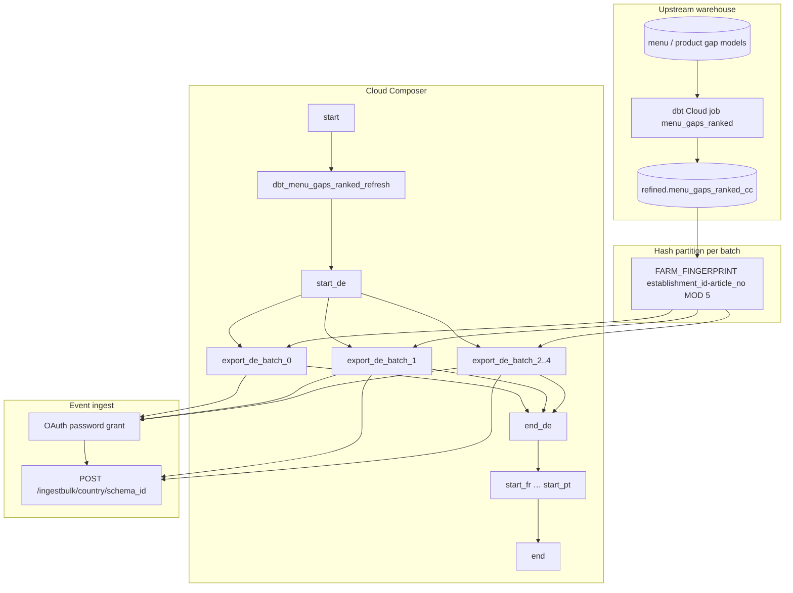

# Architecture: Ranked menu-gaps export to partner event bus

One dbt refresh, then sequential per-country blocks. Inside each
country, five parallel hash partitions stream BQ rows to Avro bulk
ingest. The DAG owns concurrency; the export module owns OAuth +
encode + POST.

## Diagram

## Components

**menu_gaps_query**  
Simple per-country SELECT (+ optional D-1 filter). Useful for smoke
checks and ad-hoc full-country pulls. The live DAG path uses the
export module's partitioned query instead.

**menu_gaps_export**  
Builds the `FARM_FINGERPRINT … MOD N = batch` SELECT, streams the BQ
iterator, Avro-encodes each row, and POSTs chunks of 2000. Schema is
parsed once per batch. OAuth client retries transient failures with
linear backoff; 401 clears the token and retries the same payload.

**DAG ordering**  
`start → dbt → {start_cc → [batch_0..4] → end_cc}×countries → end`.

Countries are chained (`end_de → start_fr → …`). Batches inside a
country fan out under `max_active_tasks=5`, which equals
`TOTAL_BATCHES`, so one country saturates the pool and the next waits
on `end_{cc}`. That is intentional — not an accidental global
parallelism limit.

## Why hash partitions instead of LIMIT/OFFSET?

Offset pagination rescans and drifts under concurrent writes. A stable
fingerprint of the natural key gives disjoint slices that re-runs can
recompute without a batch column on the refined table. Cost is one
hash per row in the WHERE clause — cheap relative to the Avro + HTTP
work.
