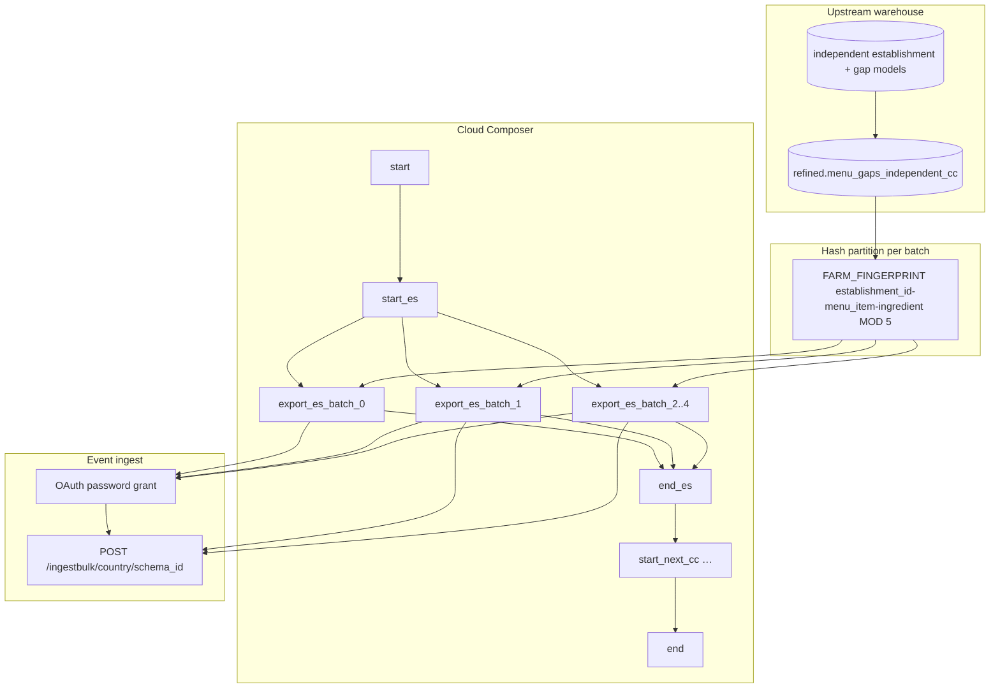

# Architecture: Independent-establishment menu-gaps export

Pure export DAG. Refined independent-gap tables are upstream; this
pipeline fans out hash partitions and streams Avro to the partner
ingest API. The DAG owns concurrency; the export module owns OAuth +
encode + POST.

## Diagram

## Components

**menu_gaps_indep_query**  
Simple per-country SELECT (+ optional D-1 filter) and the active ISO
list. Useful for smoke checks and ad-hoc full-country pulls. The live
DAG path uses the export module's partitioned query instead.

**menu_gaps_indep_export**  
Builds the `FARM_FINGERPRINT … MOD N = batch` SELECT, streams the BQ
iterator, Avro-encodes each row, and POSTs chunks of 1000. Schema is
parsed once per batch. OAuth client retries transient failures with
linear backoff; 401 clears the token and retries the same payload.

**DAG ordering**  
`start → {start_cc → [batch_0..4] → end_cc}×countries → end`.

Countries are chained. Batches inside a country fan out under
`max_active_tasks=5`, which equals `TOTAL_BATCHES`, so one country
saturates the pool and the next waits on `end_{cc}`. Same concurrency
contract as pattern 12 — intentional reuse, not copy-paste laziness.

## Why a separate schema from pattern 12?

Ranked gaps are account-linked commercial opportunities (article,
rank, revenue). Independent gaps are location + contact + menu signal
for establishments outside that book. Mixing them into one Avro type
forces either nullable commercial columns forever or a breaking
re-register when either side evolves. Two schemas, two DAGs, one
shared concurrency pattern.
