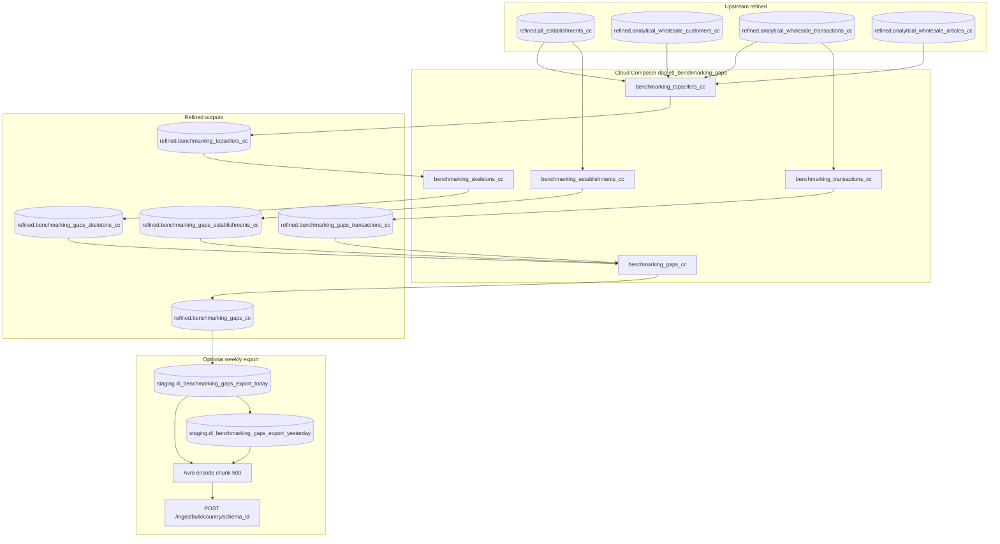

# Architecture: Peer benchmarking gaps

Composer fans out per-country BigQuery jobs. Two branches converge on
the final gaps table. A separate export path (optional) builds a
today snapshot, Avro-encodes the hash-delta vs yesterday, and POSTs
to the partner ingest API.

## Diagram

## Components

**benchmarking_gaps_queries**  
SQL builders. Topsellers keep the top ~80% revenue concentration per
segment × article family. Skeletons nest article structs under
families for peer comparison. Establishments / transactions are
ARRAY_AGG staging shapes. Final gaps UNNEST those shapes, score
families with SAFE_DIVIDE + median-normalized percentiles, and assign
customer potential bands via APPROX_QUANTILES.

**dag_benchmarking_gaps**  
Loop over enabled ISO codes. Per country:

`topsellers → skeletons → gaps`  
`establishments → transactions → gaps`

Enabled set is a subset of the full ISO list so markets without
reliable taxonomy stay dark without deleting task code.

**benchmarking_gaps_export + delta_queries**  
Export path used when the partner feed is on. Hash-delta SELECT feeds
Avro encode + chunked POST. Yesterday soft-close UPDATE keeps SCD-ish
validity flags without rebuilding history tables in the partner.

## Why a diamond, not one query?

A single mega-SELECT that builds topsellers, nests skeletons, and
scores gaps in one shot is brutal to slot and impossible to debug
when one market's taxonomy drifts. Intermediate WRITE_TRUNCATE tables
are cheap compared to an on-call night spent reading a 600-line CTE.
Countries are independent; within a country the two branches overlap
on slots but share no soft dependency until `gaps`.
