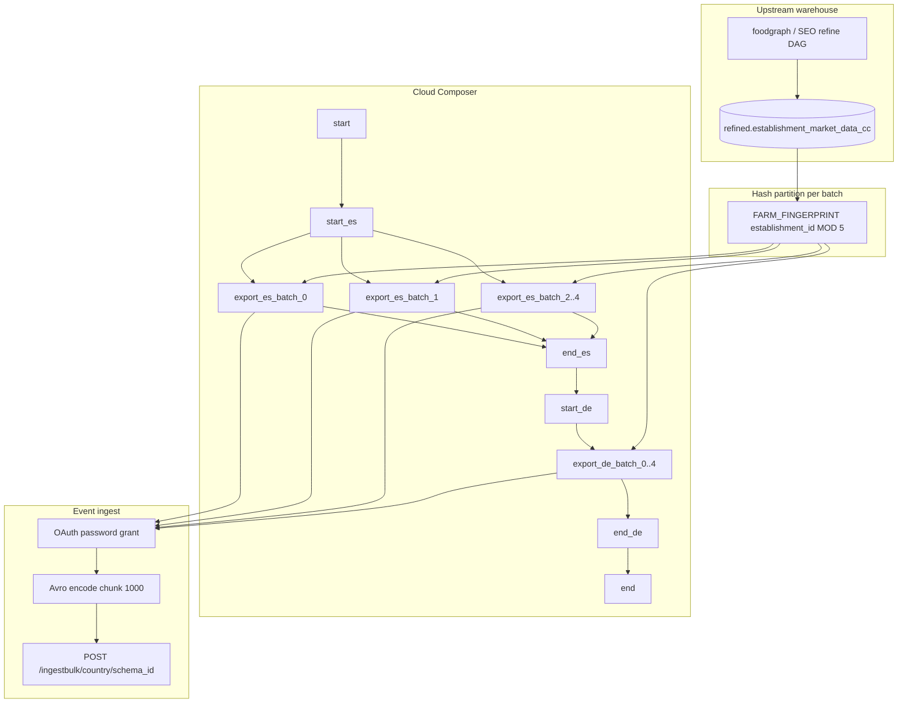

# Architecture: Establishment market-data monthly export

Composer walks countries in series. Inside each country, five parallel
hash partitions stream refined rows to Avro bulk ingest. The DAG owns
concurrency; the export module owns OAuth + encode + POST.

## Diagram

## Components

**countries**  
Single active-ISO list. Export module and DAG both import it so a
market cannot be scheduled without also appearing in the query path
(and vice versa).

**market_data_export**  
Builds the `FARM_FINGERPRINT … MOD N = batch` SELECT over the full
country table. Streams the BQ iterator, Avro-encodes each row
(doubles for geo; strings elsewhere; JSON values serialized in
Python), POSTs chunks of 1000. Schema parsed once per batch. OAuth
retries transient failures with linear backoff; 401 clears the token
and retries the same payload.

**DAG ordering**  
`start → {start_cc → [batch_0..4] → end_cc}×countries → end`.

Countries are chained (`end_es → start_de → …`). Batches inside a
country fan out under `max_active_tasks=5`. Both `end_{cc}` and `end`
use `ALL_DONE` so a single failed partition does not freeze the
graph — monitor task state separately.

## Why hash partitions instead of LIMIT/OFFSET?

Offset pagination rescans and drifts under concurrent writes. A
stable fingerprint of `establishment_id` gives disjoint slices that
re-runs can recompute without a batch column on the refined table.
Cost is one hash per row in the WHERE clause — cheap relative to the
Avro + HTTP work on a ~300k-row country.

## Why not delta like scoring exports?

Patterns 04 / 16 hash-delta a narrow score or category slice. This
contract is a wide listing document. Full monthly load keeps the
partner snapshot coherent without inventing a fragile row fingerprint
across nested JSON columns.
