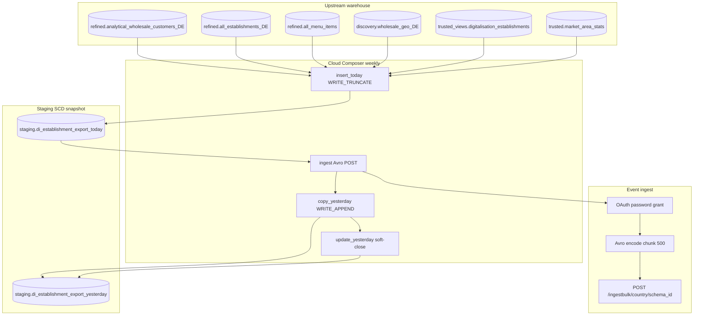

# Architecture: Establishment attribute Deepideas export

Composer owns the four-step weekly chain. The query module owns the
enrichment SELECT. The export module owns OAuth + Avro + chunked POST.
Delta SQL is shared with the same today/yesterday contract used by
other Deepideas siblings (pattern 16 documents the peer-gaps variant).

## Diagram

## Components

**establishment_queries**  
Active-buyer CTE plus rating / menu / geo / digitalisation /
market-area joins. Emits `_keyhash` (wholesale_id) and `_rowhash`
(concat of attribute columns). `ROW_NUMBER` keeps one row per buyer.

**delta_queries**  
`send_data_query` selects new or changed hashes. `copy_yesterday_query`
appends that delta. `update_yesterday_query` soft-closes superseded
yesterday rows (`_valid_flag=False`).

**establishment_export**  
Streams the send SELECT, Avro-encodes with a schema parsed once per
run, POSTs chunks of 500. 401 clears the token and retries the same
payload.

**DAG ordering**  
`insert_today → ingest → copy_yesterday → update_yesterday`.
`max_active_runs=1`, `catchup=False`, weekly schedule.

## Why hash-delta here (and not monthly full load)?

Attribute profiles change slowly relative to listing documents. A
stable `_rowhash` over a fixed column set is trustworthy. Pattern 17
rejected delta because nested JSON listing fields made fingerprints
fragile; this contract is flat scalars and ints — delta is the cheap
choice.

## Why not fold into pattern 16?

Production co-scheduled establishment with peer gaps on the same
Deepideas DAG, but the *questions* and Avro schemas differ. Shipping
them as one portfolio sample blurred review. Pattern 16 already covers
peer spend; this pattern covers the enrichment profile only.
