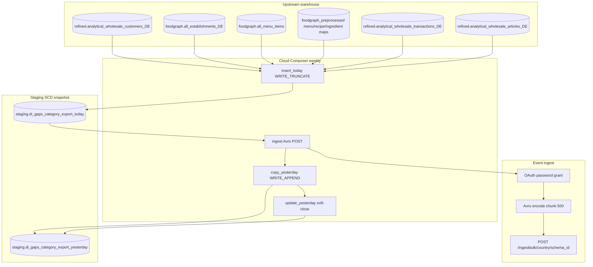

# Architecture: Deepideas main-category gaps export

Composer owns the four-step weekly chain. The query module owns the
menu→category anti-join. The export module owns OAuth + Avro +
chunked POST. Delta SQL shares the today/yesterday contract used by
establishment (pattern 20) and peer-gaps export helpers (pattern 16).

## Diagram

## Components

**gaps_category_queries**  
Active-buyer establishments joined through menu items to normalised
ingredients, then to product main categories with prioritization
relevance. Anti-join last-year category revenue (`revenue IS NULL`).
Emits `_keyhash` (wholesale_id only — production contract) and
`_rowhash` (customer + category + relevance).

**delta_queries**  
`send_data_query` selects new or changed hashes. `copy_yesterday_query`
appends that delta. `update_yesterday_query` soft-closes superseded
yesterday rows (`_valid_flag=False`).

**gaps_category_export**  
Streams the send SELECT, Avro-encodes with a schema parsed once per
run, POSTs chunks of 500. 401 clears the token and retries the same
payload.

**DAG ordering**  
`insert_today → ingest → copy_yesterday → update_yesterday`.
`max_active_runs=1`, `catchup=False`, weekly schedule.

## Why hash-delta here?

Category gaps move when menus, mappings, or purchase history move —
often weekly, not daily. The payload is four flat fields, so
fingerprints are trustworthy. Pattern 17 rejected delta for nested
listing JSON; this contract is the opposite shape.

## Why not fold into pattern 16 or 20?

Production co-scheduled gaps_category with establishment on the same
Deepideas DAG, and peer gaps have their own daily diamond. The
*questions* and Avro schemas differ:

- 16 = under-index vs peers
- 20 = enrichment profile (one row per buyer)
- 21 = zero-purchase category implied by the menu

Shipping them as one portfolio sample blurred review. Keep the
contracts separate.
