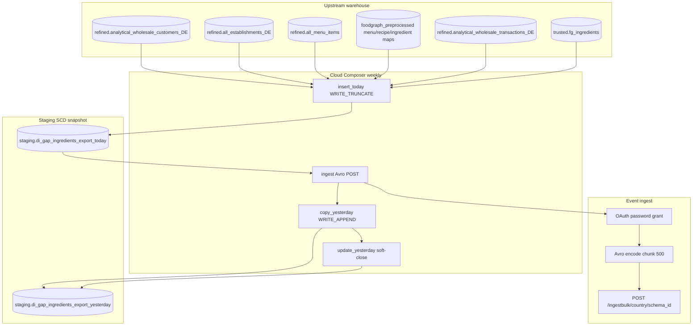

# Architecture: Deepideas gap-ingredients export

Composer owns the four-step weekly chain. The query module owns the
menu→recipe→ingredient anti-join. The export module owns OAuth + Avro +
chunked POST. Delta SQL shares the today/yesterday contract used by
establishment (pattern 20) and category gaps (pattern 21).

## Diagram

## Components

**gaps_ingredients_queries**  
Active-buyer establishments joined through menu items to recipes and
ingredients, with prioritization relevance and ingredient translations.
Anti-join last-year ingredient revenue (`revenue IS NULL` on
`wholesale_id × ing_id`). Emits `_keyhash` (wholesale_id only —
production contract) and `_rowhash` (customer + ingredient + category +
relevance).

**delta_queries**  
`send_data_query` selects new or changed hashes. `copy_yesterday_query`
appends that delta. `update_yesterday_query` soft-closes superseded
yesterday rows (`_valid_flag=False`).

**gaps_ingredients_export**  
Streams the send SELECT, Avro-encodes with a schema parsed once per
run, POSTs chunks of 500. 401 clears the token and retries the same
payload.

**DAG ordering**  
`insert_today → ingest → copy_yesterday → update_yesterday`.
`max_active_runs=1`, `catchup=False`, weekly schedule.

## Why ingredient grain, not fold into pattern 21?

Category gaps tell assortment planners which main categories are
missing. Ingredient gaps tell recommender / offer systems which
specific ingredients the menu already uses. Partner Avro schemas
differ (four fields each, but different names and grain). Shipping
them as one sample blurred review.

Join path is thinner here: menu→recipe→ingredient only. Pattern 21
also unions extracted-ingredient arrays. That is deliberate production
divergence, not a refactor opportunity for this portfolio sample.

## Why hash-delta here?

Ingredient gaps move when menus, mappings, or purchase history move —
often weekly, not daily. The payload is four flat fields, so
fingerprints are trustworthy. Pattern 17 rejected delta for nested
listing JSON; this contract is the opposite shape.
