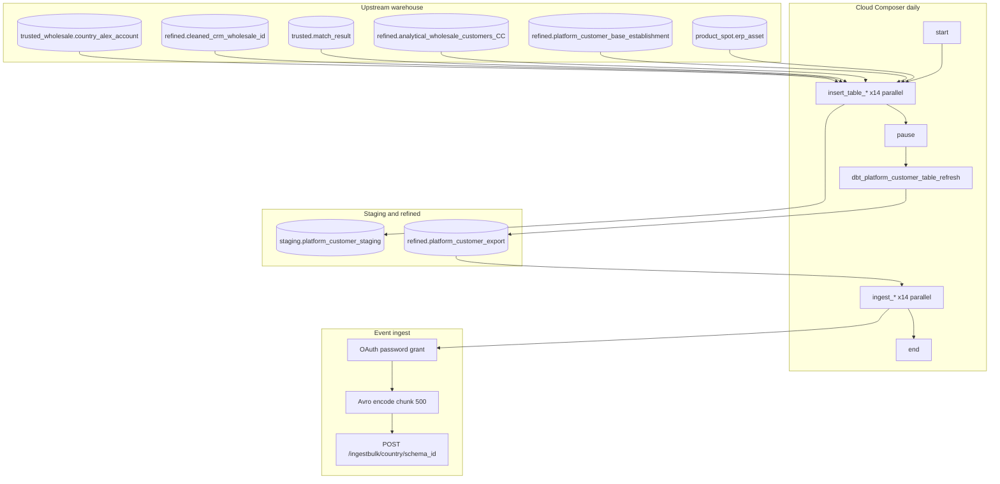

# Architecture: Multi-country platform-customer footprint export

Composer owns the three-phase daily chain. The query module owns
country-scoped matching SQL. The export module owns OAuth + Avro +
chunked POST. dbt owns staging → refined SCD/valid-flag materialization
(job id externalized to an Airflow Variable).

## Diagram

## Components

**customer_query.PlatformCustomer**  
Per-country insert SQL joins wholesale account identifiers, CRM-cleaned
IDs, fuzzy match results, product-spot assets, and the establishment
product base. Optional POS match via a secondary establishment source
is full-outer-joined so a wholesale_id can carry POS without a CRM
subscription row. Send SQL reads today's valid refined rows.

**customer_export.send_platform_customer_data**  
Streams the send SELECT, Avro-encodes with a schema parsed once per
run, POSTs chunks of 500. 401 clears the token and retries the same
payload. HTTP errors raise.

**DAG ordering**  
`start → [14 inserts] → pause → dbt → [14 ingest] → end`.
`max_active_runs=1`, `catchup=False`, daily `5 5 * * *`.

## Truncate-then-append staging

First country in `country_list` uses `WRITE_TRUNCATE`. Remaining
countries `WRITE_APPEND` into the same staging table. That is how one
dbt job sees all markets. Reordering the list changes who truncates —
treat the first element as sacred, or make truncate an explicit flag.

## Why dbt between staging and ingest?

Country SQL produces a wide, join-heavy footprint. dbt applies the
SCD / `_valid_flag` contract the partner feed expects. Keeping that
out of the Python export module meant we could change validity rules
without redeploying Composer packages. Timeout is 300s — monitor it
when the staging table grows.

## Why not hash-delta like patterns 20–22?

Partner contract here is "current footprint for today," not "changed
rows only." The payload is wide (dozens of product timestamps). Row
hashes would be fragile across cast/nullability tweaks. Full daily
resend per country was cheaper operationally than debugging false
deltas. Patterns 20–22 use delta because their Avro contracts are
tiny and change-driven.
