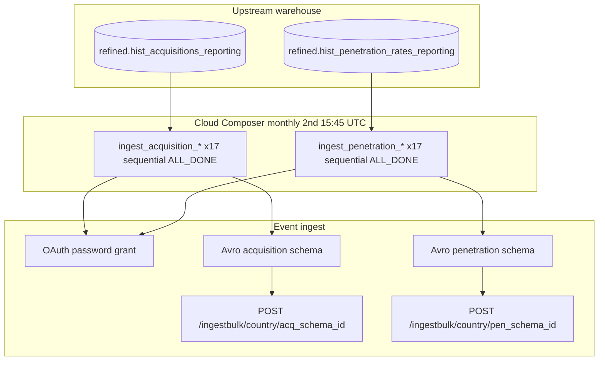

# Architecture: MAG acquisition + penetration monthly export

One Composer DAG, two independent sequential country chains. Each
task is a BQ SELECT → Avro encode → chunked POST. No staging table,
no dbt hop — the refined historical MAG tables are already the
contract.

## Diagram



## Components

**mag_acquisition.send_mag_acquisition_data**  
Reads `refined.hist_acquisitions_reporting` for one country (or the
corporate rollup), Avro-encodes `date / product_bundle / sales_value /
sales_all_time`, POSTs chunks of 500.

**mag_penetration.send_mag_penetration_data**  
Reads `refined.hist_penetration_rates_reporting` for one country,
Avro-encodes active/buying wholesale + active/paying platform counts,
POSTs chunks of 500. ISO markets coerce nulls to 0; aggregate does not.

**DAG ordering**  
Two separate chains with no cross-edge:

```
acq_hr >> acq_cz >> … >> acq_ag
pen_hr >> pen_cz >> … >> pen_ag
```

`max_active_runs=1`, `catchup=False`, monthly `45 15 2 * *`.

## Why sequential countries, not parallel?

Historical MAG tables are small (date × bundle or date × rate), so
BQ cost is not the constraint — the event API rate limit and ops
clarity are. A linear chain with `ALL_DONE` makes "which market is
stuck?" obvious in the Graph view and keeps concurrent POSTs low.
If a market permanently fails, later markets still run.

## Why two chains in one DAG?

Same cadence, same owner, same upstream month-end refine. Splitting
into two DAGs would duplicate the schedule and double the place you
look when month-end slips. Keeping them sibling chains preserves
independent failure domains without splitting ownership.

## Aggregate market (`ag`)

Composer task id uses `ag`. Warehouse filter uses `corp`
(`reseller_country` for acquisition, `country` for penetration).
Partner ingest path still keys on the Composer country code:
`/ingestbulk/ag/{schema_id}`. Do not "fix" that by forcing an ISO.
