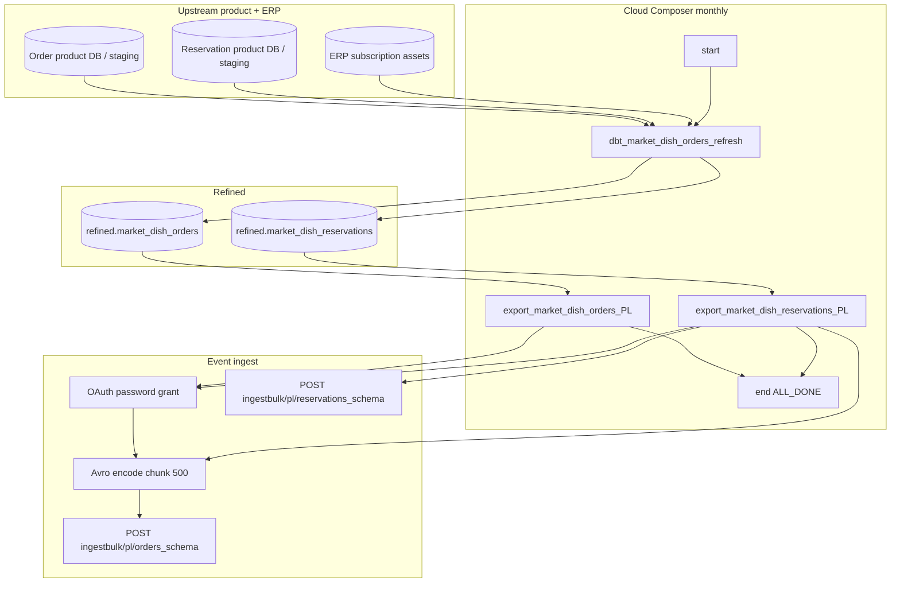

# Architecture: Single-market Order + Reservation export

Composer owns schedule + dbt wait + two export tasks. The query
module owns typed SELECTs against the refined tables. The export
module owns OAuth + Avro + chunked POST for both contracts. dbt owns
materializing `refined.market_dish_orders` and
`refined.market_dish_reservations` under one job tag.

## Diagram

## Components

**orders_query.MarketDishOrders**  
Typed CAST / FORMAT_TIMESTAMP SELECTs for both refined tables. Keeps
Avro nullability honest at the SQL boundary so the Python mapper stays
thin.

**orders_export._send_dataset**  
Shared stream → Avro → chunked POST. Orders and Reservations call it
with different query / schema / schema_id / row mapper. Schema is
parsed once per send. 401 clears the token and retries the same
payload. Transient HTTP / JSON errors back off up to 10 attempts.

**DAG ordering**  
`start → dbt → [orders export, reservations export] → end`.
`max_active_runs=1`, `max_active_tasks=1`, `catchup=False`, monthly
`0 6 1 * *`. End uses `ALL_DONE` so one failed product still lets the
other finish for ops visibility.

## Why one dbt job for two tables?

Orders and Reservations share the same wholesale / asset join shape.
One tagged job keeps their refine windows aligned so the partner does
not see Orders from month M and Reservations from month M-1 on the
same ship. Timeout 600s — monitor when asset joins grow.

## Why full monthly reship?

Partner contract is "current lifetime extract," not "rows changed
since last run." Owner + asset + order fields are wide enough that
row hashes would fire on cast/nullability noise. One market, monthly
cadence, chunk size 500 — full reship was the operable choice. If
volume grows, add a watermark before inventing a second DAG.
