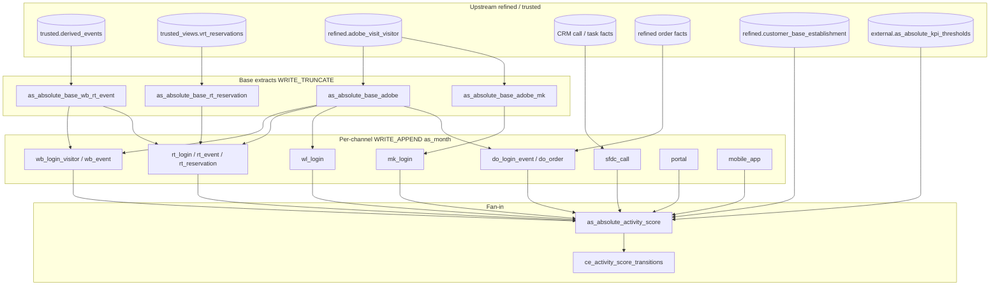

# Architecture: absolute multi-channel activity scores

Four layers in one monthly Composer DAG: base extracts, per-channel
rolling activity, thresholded fan-in score, MoM transition flags.

## Diagram

## Components

**Base extracts**  
Rebuild once per run. The event base drops days with ≥1000 distinct IDs
for the same event label — a blunt anti-spike filter that kept bot-like
menu thrash from inflating scores. Reservation and Adobe bases normalize
product labels and login vs visitor grain.

**Channel tables**  
Each channel projects onto `(salesforce_id, country_code, as_month)` with
rolling 3/6/12-month denominators and country-relative ranks. Partition
field is `as_month`. WRITE_APPEND keeps history for MoM and audits.

**Fan-in score**  
FULL OUTER JOIN across channels, left join threshold table by country
type, compute boolean activity / regular / power flags, then:

`activity_score = activity + regular_user + power_user` (0–3).

Also emits per-product sub-scores and `establishment_active`.

**MoM transitions**  
Compares current vs prior month score and materializes boolean flags
(`has_upscored_*`, `has_downscored_*`, `has_unchanged_*`) for engagement
reporting. WRITE_TRUNCATE — only the latest comparison matrix is needed.

## Why Composer edges instead of one mega-query?

A single SQL job would have been cheaper to author once. It would also
have made partial failure opaque: when Adobe lag killed the run, you
lost reservation and CRM work too. Splitting bases and channels let us
retry the slow path without recomputing everything, and made the fan-in
barrier obvious in the UI when a new channel was added.
