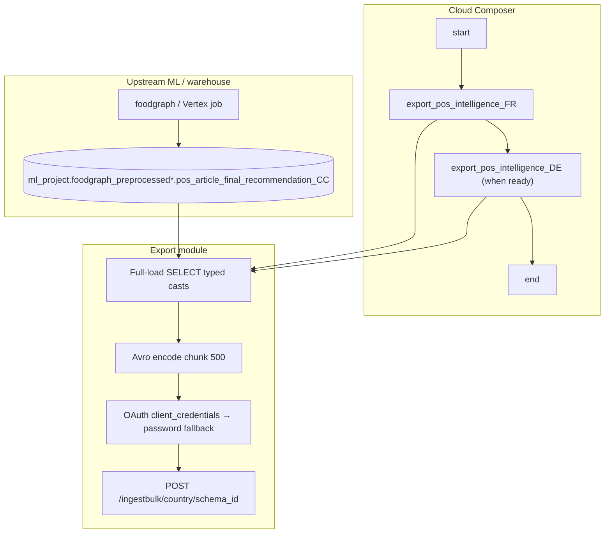

# Architecture: POS Intelligence recommendations export

Composer walks countries in series. Each country task streams the
full Vertex recommendation table to Avro bulk ingest. The DAG owns
ordering and timeouts; the export module owns OAuth + encode + POST.

## Diagram

## Components

**COUNTRY_ISO_CODES**  
Shared list imported by the DAG and the export module. Pilot is
`["fr"]`. Append `"de"` only after the Vertex `_{CC}` table exists —
scheduling a market without a table produces a hard BQ failure, which
is preferable to silently shipping empty payloads.

**pos_intelligence_export**  
Builds a typed full-load SELECT (no date filter, no hash shard).
Streams the BQ iterator, Avro-encodes each row, POSTs chunks of 500.
Schema parsed once per country task. OAuth tries
`client_credentials` across configured secrets, then password-grant;
401 on ingest clears the token and retries the same chunk.

**DAG ordering**  
`start → export_pos_intelligence_{CC}×countries → end`.

Countries are chained. `max_active_tasks=1` matches that chain so a
second market never overlaps the first. `end` uses `ALL_DONE` so a
failed country does not leave the DAG hanging once multi-country
rolls out.

## Why no FARM_FINGERPRINT batches?

Patterns 12/17 shard wide / large country tables so five workers can
share the wall-clock. This feed started as a single-market pilot
with a narrower recommendation row. Sequential full-table stream
with a 4-hour task timeout was enough. If a later market balloons,
add hash partitions the same way as pattern 12 — do not invent a
new concurrency model first.

## Why client_credentials first?

Password-grant alone worked for older event-ingest DAGs, but
service accounts and realm-scoped tokens prefer
`client_credentials`. Falling back keeps the DAG green during
credential rotations without a mid-month deploy. Logging which
credential name succeeded is deliberate — ops needs that breadcrumb
when two secrets are configured and only one works.
