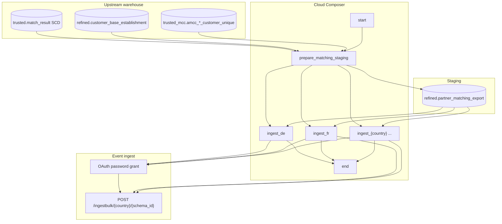

# Architecture: Matching engine export to partner event bus

One staging rebuild, then parallel per-country Avro ingest. Prepare
owns the join + unpivot; the export module owns OAuth + Avro + chunked
POST. The DAG only wires order.

## Diagram

## Components

**matching_prepare**  
Per-country SQL joins current valid matches (`_valid_flag`, quality
`<= 150`, two request types) onto wholesale customer attrs and the
establishment product footprint. Pandas unpivots product flags into
service rows, applies inactive code offset (+700), dedups by activity
then oldest `date_from`, and `to_gbq(..., if_exists='replace')` the
staging table.

**matching_event_export**  
BQ SELECT by country → Avro encode → chunk 500 → bulk POST. One OAuth
client per ingest task (tasks run in parallel). Schema parsed once per
send. HTTP errors raise; 401 clears the token and retries with the
same payload.

**DAG ordering**  
`start → prepare → {ingest_hr, ingest_cz, ...} → end`. Fan-out after
prepare is the point: one rebuild contract, independent country
failure domains. A flaky `ua` API does not block `de` delivery for the
week.

## Why not one ingest task that loops countries?

A single long PythonOperator hides per-country runtime and turns one
market outage into a full-feed failure. Parallel tasks give retries,
clearer logs, and the option to clear/re-run one market without
rewriting staging.
