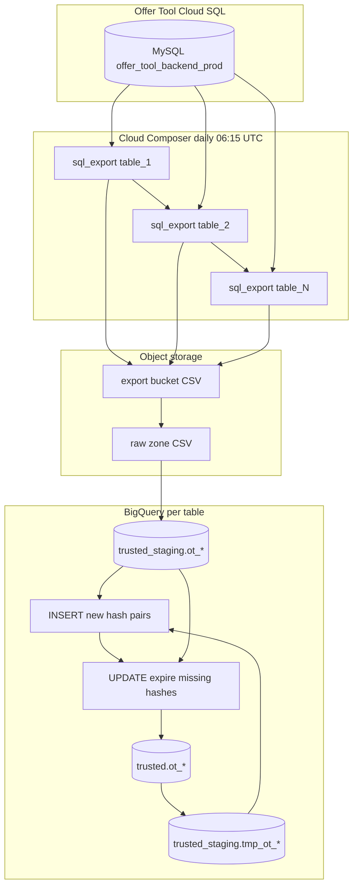

# Architecture: Offer Tool Cloud SQL → BigQuery SCD Type 2

Composer owns schedule and task graph. Cloud SQL Admin owns the CSV
dump (SELECT with hashes). GCS holds export + raw-zone copies.
BigQuery owns staging truncate, tmp snapshot, insert-new / expire-old
SCD steps, and the final trusted promote.

## Diagram

Per-table chain after each export:

`sql_export → cp_file → copy_tmp → load_staging → insert → update → promote`

Exports are sequential (`last_task >> next_export`). Load chains run
in parallel once their export completes — roughly 15 × 7 tasks per
run without overlapping Cloud SQL dumps.

## Components

**export_queries.EXPORT_QUERIES**  
MySQL SELECTs that project business columns, stamp `_sourcesystem`,
and compute `_keyhash` / `_rowhash`. Newlines in comments become
` [cr] ` so CSV row boundaries stay intact.

**CloudSQLExportInstanceOperator**  
Server-side `selectQuery` export into the product project's export
bucket. Instance IAM must allow write to that bucket URI.

**GCSToGCS + GCSToBigQuery**  
Copy into the platform raw zone (retention / audit), then
WRITE_TRUNCATE load into `trusted_staging` using a schema JSON object
per table.

**SCD loop on tmp**  
1. Snapshot trusted → `tmp_ot_*`  
2. Append staging rows whose `concat(_keyhash,_rowhash)` is not in
   current valid OfferTool rows  
3. Expire tmp rows still valid but absent from today's staging  
4. WRITE_TRUNCATE trusted from tmp

`_sourcesystem='OfferTool'` keeps the expire step from touching rows
that might share the table from another feed later.

## Why not MERGE in one shot?

The production lineage used insert → update → copy because that was
the house pattern when Cloud SQL exports landed. A single MERGE is a
reasonable next step (same as later matching-engine migrations) but
was not required for correctness here — and the three-step form is
easier to debug when a hash column drifts.
