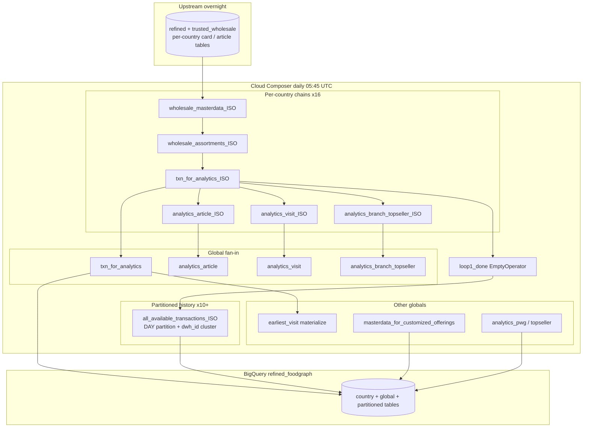

# Architecture: Food Graph refined multi-country zone

Composer owns schedule, country fan-out, the `loop1` sync barrier, and
destination table contracts. BigQuery owns the SQL (WRITE_TRUNCATE
insert jobs, optional night-ETL reservation). Upstream trusted /
refined wholesale tables are assumed ready before 05:45 UTC.

## Diagram

## Components

**Country tuple loop**  
`(iso_code, source_prefix, currency)` drives task_id, destination
table suffix, and currency literals in analytics queries. One loop
builds the whole fan-out — no hand-written DE/FR/PL DAG copies.

**TaskGroup `wholesale_assortments`**  
UI grouping only (`prefix_group_id=False`). Dependencies stay on the
individual operators so fan-in edges remain readable in Graph View.

**`loop1_done`**  
EmptyOperator barrier. Every `txn_for_analytics_{ISO}` points here.
Partitioned loads depend on `loop1`, not on a single large country.
That is intentional: a late PL job must block ES partitioned history
if the product contract says "all markets fresh."

**Global UNION ALL jobs**  
Separate truncate tasks that select from country tables. Edges from
each country task into the global task give Airflow the right
scheduler order without a second DummyOperator.

**Partitioned inserts**  
`timePartitioning: DAY` on `date_of_day` and `clustering: [dwh_id]`
set at jobs.insert time so CREATE_IF_NEEDED gets the physical layout
right on first create. Legacy Python "delete table + range partition"
helpers are intentionally not shipped — production replaced them with
inline BQ operators.

**Reservation Variable**  
If `foodgraph_bq_reservation` is set, jobs.insert gets a
`reservation` field (night-ETL slots). Empty string keeps on-demand
for local reference runs.

## Boundaries

| Layer | Owns |
|-------|------|
| Composer | Schedule, graph, Variables, retries |
| BigQuery | SQL, partitions, clustering, slot usage |
| Upstream MCC/wholesale DAGs | Trusted card + article freshness |
| Downstream COP / ML | Consume refined tables; do not rebuild them |

## Failure modes

- One country txn failure blocks `loop1` and all partitioned loads.
- Fan-in globals wait on every contributing country edge — same blast
  radius.
- Missing `wholesale_to_dwh_id_mapping` rows silently drop
  establishments from partitioned history (inner join).
