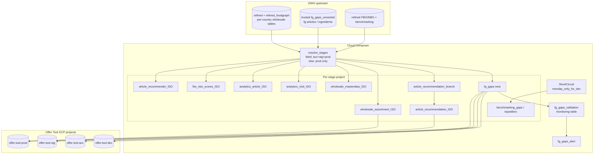

# Architecture: Offer Tool weekday-aware zone fan-out

Composer owns stage resolution, country loops, SoftCircuit gates, and
destination table contracts. BigQuery owns WRITE_TRUNCATE jobs into
product-owned projects. Upstream refined / trusted tables are assumed
fresh before this DAG is triggered.

## Diagram

## Components

**`resolve_stages`**  
Pure function: env + ISO weekday → list of `(stage, project_id)`.
Keeps the weekday cost policy testable without spinning Composer.

**`monday_only_for_dev` ShortCircuit**  
DEV Composer returns False Tue–Sun so benchmarking skeletons and
country gap tables do not rebuild on idle nights. Prod always returns
True.

**Stage × country nested loops**  
Outer country lists differ by product surface (assortment vs scores vs
recommender). Inner loop is the active stage list for *this* run —
Wednesday expands the cartesian product.

**`fg_env_for_stage`**  
Product `dev` stage reads trusted `_dev` Food Graph tables; acc / stg /
prod read `_acc`. Avoids pointing production Offer Tool at unfinished
ML gap runs.

**Gaps validation chain**  
After each stage `fg_gaps` truncate, compare nested product counts to
warehouse unnested. Diffs land in `monitoring.offer_tool_fg_gaps_test`
then the alert task. Production used a webhook; portfolio logs.

**Partition / cluster at jobs.insert**  
Visit / article / benchmarking / recommender tables set
`timePartitioning` and `clustering` on CREATE_IF_NEEDED so first
create matches the product contract.

## Boundaries

| Layer | Owns |
|-------|------|
| Composer | Stage list, graph, ShortCircuit, retries |
| BigQuery DWH | Source refined / trusted freshness |
| Offer Tool projects | Product IAM, App Engine / Cloud Run readers |
| Pattern 27 SCD DAG | OLTP → trusted history (separate schedule) |
| Pattern 46 refined zone | Builds refined_foodgraph this DAG copies |

## Failure modes

- Wednesday slot spike: three full stage rebuilds — expect longer queues;
  do not overlap with Food Graph refined night-ETL without a reservation.
- Soft-delete filter miss: deleted wholesale cards appear in product UI —
  check `exclude_deleted_statement` field choice (`wholesale_id` vs
  `unique_wholesale_id`).
- Branch → country edge break: `article_recommendation_*` waits on
  stage branch table; a failed branch blocks seven countries for that
  stage only.
