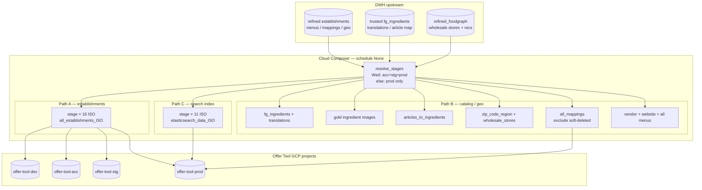

# Architecture: Offer Tool on-demand zone

Composer owns stage resolution, dual country loops, and destination
table contracts. BigQuery owns WRITE_TRUNCATE jobs into product-owned
projects. Upstream refined / trusted tables are assumed fresh enough for
a manual trigger — this DAG does not wait on pattern 46 / 48.

## Diagram

## Components

**`resolve_stages`**  
Pure function: env + ISO weekday → list of `(stage, project_id)`. Same
policy as pattern 48 so on-demand and scheduled publishes agree on which
product projects are live.

**Dual country loops**  
Establishments land for 16 ISOs (includes CZ, RS, SK, TR, UA). Search
index lands for 11 ISOs where Elasticsearch is product-wired. Mixing
them in one list would either over-publish empty ES tables or under-serve
establishment cards.

**`fg_env_for_stage`**  
Product `dev` reads trusted `_dev` Food Graph tables; acc / stg / prod
read `_acc`. Avoids pointing acceptance Offer Tool at unfinished ML cuts.

**Soft-delete filter on mappings**  
`exclude_deleted_statement` drops wholesale cards (and unique ids where
every card is deleted) before WRITE_TRUNCATE into `all_mappings`.

**No SoftCircuit / validation chain**  
Unlike #48 there is no Monday gate and no nested-vs-unnested gaps
monitor. This DAG is intentionally thin — if you need gap nests, run #48.

## Boundaries

| Layer | Owns |
|-------|------|
| Composer | Stage list, country loops, retries, manual trigger |
| BigQuery DWH | Source refined / trusted freshness |
| Offer Tool projects | Product IAM, App Engine / Cloud Run readers |
| Pattern 48 scheduled zone | Gaps / assortment / scores / recommender |
| Pattern 27 SCD DAG | OLTP → trusted history (separate schedule) |

## Failure modes

- Triggered on a non-Wednesday for "refresh acc": stage list is prod-only
  until you reparse on Wednesday or temporarily force the stage list.
- One country truncate fails: others still land — clear the single task.
- Soft-delete filter miss: deleted wholesale cards appear in search /
  mapping UI — check field choice (`wholesale_id` vs `unique_wholesale_id`).
- Overlap with Wednesday #48: both fan out to three stages — prefer not
  to double-trigger; `max_active_runs=1` only protects *this* DAG.
