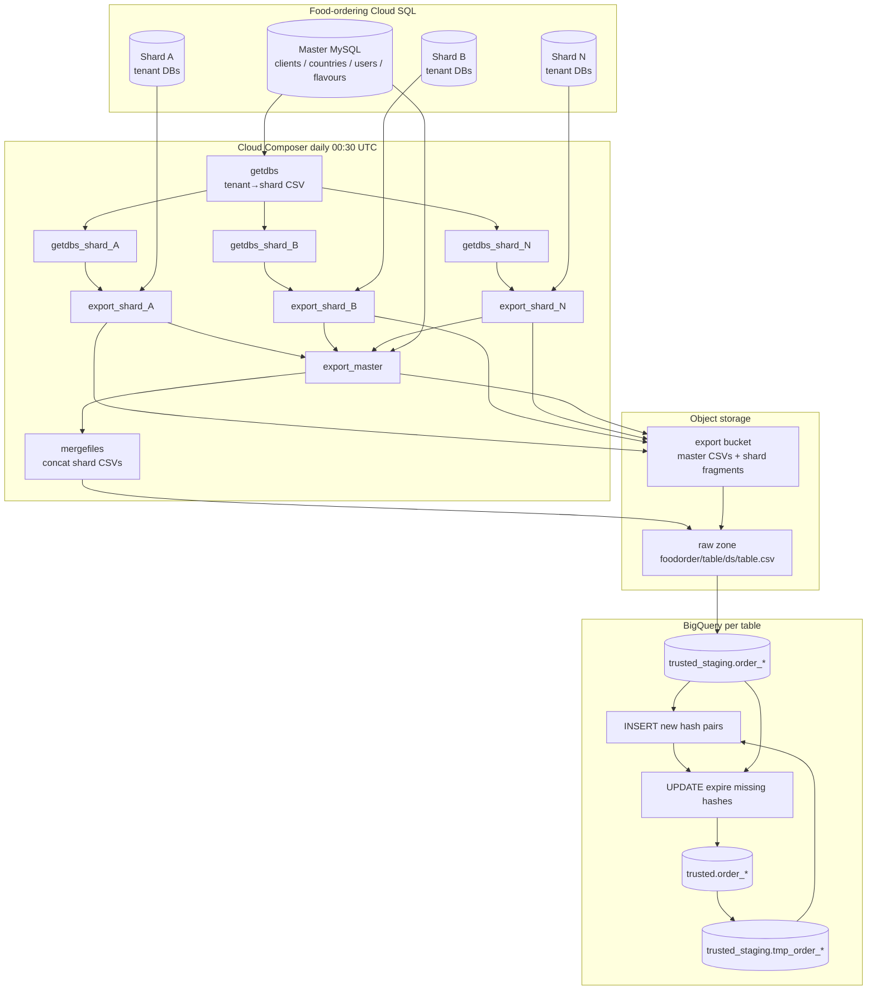

# Architecture: multi-shard food-ordering Cloud SQL → BigQuery SCD2

Composer owns schedule and the task graph. Bash scripts on the
Composer data folder own Cloud SQL CSV export and shard merge. GCS
holds export staging + raw-zone objects. BigQuery owns staging
truncate, tmp snapshot, insert-new / expire-old SCD steps, and the
final trusted promote — pinned to the night-ETL reservation.

## Diagram

Per-table chain after merge:

`download_or_skip → snapshot_tmp → load_staging → insert → expire → promote → wait_for_files → clean`

Master tables take a `GCSToGCS` hop from the export bucket into the
raw zone. Sharded tables are already written there by `mergefiles`,
so the download task is an `EmptyOperator`.

## Components

**shard_config.SHARD_INSTANCES**  
Instance name → private IP. Production held ~44 entries; this sample
keeps four so the fan-out is obvious without a wall of task ids.

**getdbs.sh + getdbs_{instance}**  
Master export of `ti_clients ⨝ ti_server_instances` →
`foodorder_dbs.csv`. Each shard task greps its IP and writes a
per-instance tenant list the export script consumes.

**dishordersplitted.sh / dishorder.sh**  
`gcloud sql export csv` with SELECTs that stamp `_keyhash`,
`_rowhash`, `_create_ts`, `_job_name`, `_sourcesystem`. Shard script
walks tenant DBs; master script exports the four reference tables
once.

**dishordermerge.sh**  
Concatenates shard fragments (header once) into
`gs://{raw}/foodorder/{table}/{ds}/{table}.csv` via `gsutil -m`.

**ReservedBigQueryInsertJobOperator**  
Same SCD insert / expire / promote shape as Offer Tool (#27), but
query jobs are pinned to the DWH reservation so the overnight wave
does not burn on-demand slot budget.

## Why bash fan-out instead of one giant operator?

Cloud SQL Admin export is per-instance. Parallel BashOperators map
1:1 onto shards, give you clear retry boundaries when one shard
blows a 409, and keep the merge step as a single barrier before any
BigQuery load starts. A TaskGroup rewrite would clean the UI; it
would not change the export physics.
