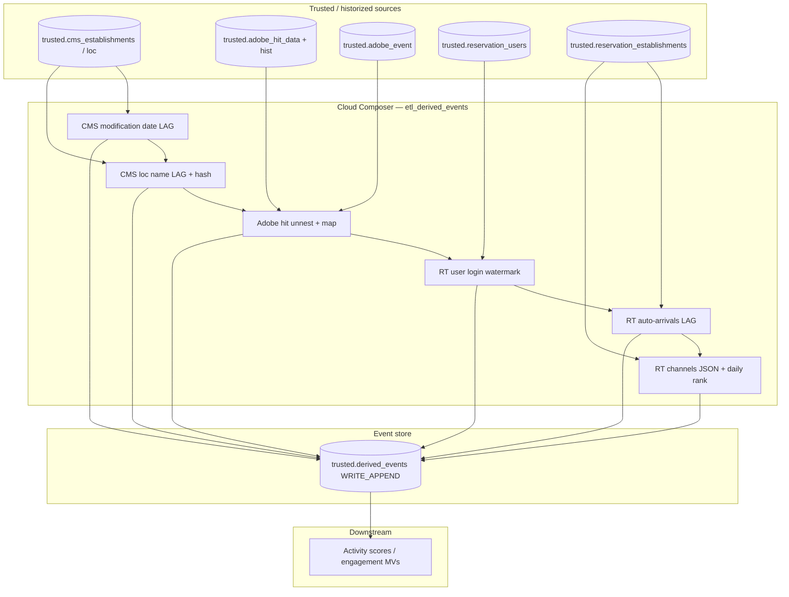

# Architecture: Derived events change-detection

Composer runs a sequential chain of BigQuery insert jobs. Each job
reads a historized trusted table (or Adobe hit feed), detects a change
or maps a custom event, and WRITE_APPENDs into a shared event store.

This folder ships a **representative subset** of the production
~58-task monolith: two CMS, one Adobe, three Reservation Tool tasks.

## Diagram

## Components

**DAG (`dag_derived_events.py`)**  
Daily 05:30 UTC. `max_active_runs=1`. Six `ReservedBigQueryInsertJobOperator`
tasks chained sequentially to mirror production failure semantics.
Project / connection from Airflow Variables.

**SQL builders (`event_queries.py`)**  
One function per detection style. Destination table name is injected so
the hash anti-join stays consistent with the WRITE_APPEND target.

**Reservation wrapper (`bq_reservation.py`)**  
Pins jobs.insert onto the night-ETL capacity reservation. Same idea as
pattern 56.

## Detection styles in this subset

| Task | Style |
|------|--------|
| CMS modification date | `LAG` on timestamp; no hash anti-join |
| CMS loc name | `LAG` + `nth_record > 1` + hash `NOT IN` + bad-date filter |
| Adobe datafeed | Hit `UNNEST` + custom-event CASE map; hit-scoped hash |
| RT user login | `GROUP BY` watermark; hash anti-join only |
| RT auto-arrivals | Classic SCD boolean `LAG` |
| RT channels | Composite JSON payload + `record_rank_per_day = 1` |

## Failure modes

| Mode | Behaviour |
|------|-----------|
| Mid-chain BQ failure | Downstream event categories skip for that run |
| Re-run after partial success | Hash anti-join skips already-written rows (Adobe hash differs) |
| SCD backfill churn | Per-day rank (channels) collapses noise to one row |
| Known bad historization date | Loc-name query excludes `2018-10-09` |
| Slot contention | Reservation wrapper; still sequential wall-clock cost |
