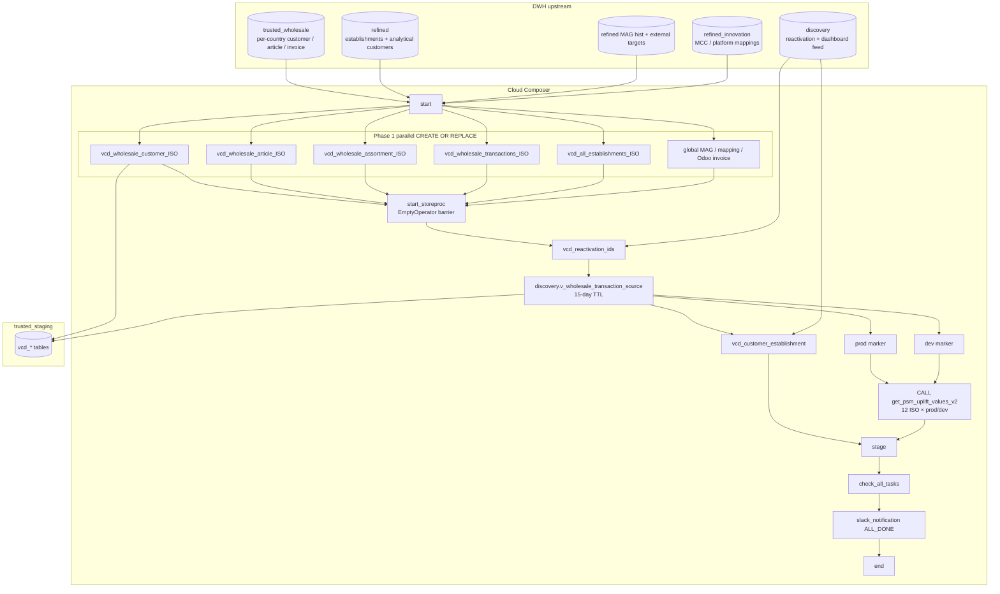

# Architecture: Value Creation Zone bi-monthly refresh

Composer owns schedule, country fan-out, the sync barrier, stored-proc
env markers, and run-status aggregation. BigQuery owns CREATE OR
REPLACE staging tables, the TTL discovery union, and the PSM uplift
procedure. Upstream trusted_wholesale / refined / MAG tables are
assumed fresh before the 3rd/8th window.

## Diagram

## Components

**Bi-monthly schedule (`15 5 3,8 * *`)**  
Two calendar anchors per month. Early-month (3rd) catches prior-month
close; mid-month (8th) refreshes after MAG / acquisition hist land.
Not a daily zone — that is the intentional cost / stability tradeoff.

**Phase 1 parallel CREATE OR REPLACE**  
Every country job and every global reference job chains
`start → job → start_storeproc`. Airflow fans them out; the barrier
does not open until the slowest CREATE finishes.

**Austria special-casing**  
AT synthesizes `unique_wholesale_id`, nulls assortment descriptors,
and skips the hospitality filter. Keeping that in the SQL builders
avoids a second DAG just for one market's ID quirks.

**TTL discovery union**  
After the barrier, country transaction shards are wild-card-unioned
into `discovery.v_wholesale_transaction_source` with a 15-day
expiration. BE is unioned with a historical cut-off. The stored proc
reads one table; operators do not inherit permanent working tables.

**Prod / dev stored-proc fan-out**  
12 markets × 2 envs call `get_psm_uplift_values_v2`. RS / UA / AT / TR
are skipped (no procedure). EmptyOperator markers (`prod`, `dev`) keep
the Graph readable when debugging one env.

**ALL_DONE status aggregation**  
`check_all_tasks` XComs sibling states; `slack_notification` runs under
`ALL_DONE` so a partial staging failure still surfaces a summary. The
portfolio stubs the webhook to a log line.

## Boundaries

| Owns | Does not own |
|------|----------------|
| Staging materialization + barrier | PSM CSV land from GCS (sibling DAG) |
| Calling uplift stored proc | Body of `get_psm_uplift_values_v2` |
| Country SQL quirks in builders | Daily Food Graph / Offer Tool zones |
| Run-status aggregation | Dashboard Looker / BI layer |

## Operability notes

- `max_active_runs=1` — do not let a slow 3rd overrun collide with the 8th.
- Slot pressure is the failure mode on DE/FR/PL CREATE OR REPLACE nights.
- If one country CREATE fails, the barrier never opens and no SP runs —
  preferred over half-stale uplift numbers on the dashboard.
