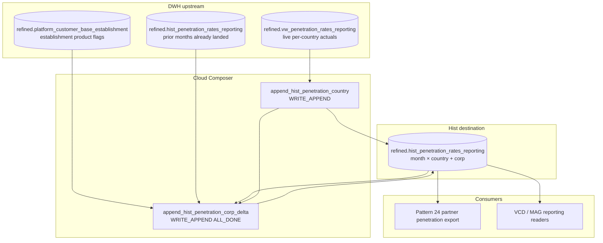

# Architecture: MAG penetration monthly historization

Composer owns the 2nd-of-month schedule and the two-task sequential
chain. BigQuery owns the country aggregation, the customer-base delta
math, and the append into the hist table. Upstream live views and the
customer-base establishment table are assumed closed for the prior
month before 07:16 UTC on the 2nd.

## Diagram

## Components

**Calendar schedule (`16 7 2 * *`)**  
Runs on the 2nd at 07:16 UTC — one day after the archived 1st-of-month
sales/acquisitions historization sibling. Reporting month is always
`DATE_SUB(DATE_TRUNC(CURRENT_DATE, MONTH), INTERVAL 1 MONTH)`.

**Task 1 — country actuals**  
`WRITE_APPEND` of grouped sums from the live penetration view. One row
per country for the reporting month. No dependency on hist contents.

**Task 2 — corporate delta**  
Reads the customer-base establishment grain, computes segment counts,
then subtracts the same-month hist sums (including what task 1 just
appended, plus any prior corp row if a bad re-run already wrote one).
Writes a single `country = 'corp'` row via `WRITE_APPEND`.

**ALL_DONE trigger on task 2**  
Production wiring. Documents the failure mode: corp can append even
when country append failed. Prefer investigating before clear+rerun.

## Boundaries

| Owns | Does not own |
|------|----------------|
| Month-grain append of penetration hist | Live daily refined zone spine |
| Country → corp sequential contract | Partner Avro export (pattern 24) |
| Delta definition for corp rollup | dbt models / Looker dashboards |
| Schedule relative to 1st-of-month sibling | Sales / acquisitions hist tables |

## Operability notes

- `max_active_runs=1` — overlapping monthly runs would double-append.
- Idempotency is the main gap: add a delete-for-month guard before
  append if this ever moves to a shared Composer where clear-downstream
  is common.
- Slot cost is low (two queries). Correctness risk is higher than cost
  risk — watch for duplicate `date × country` after re-runs.
