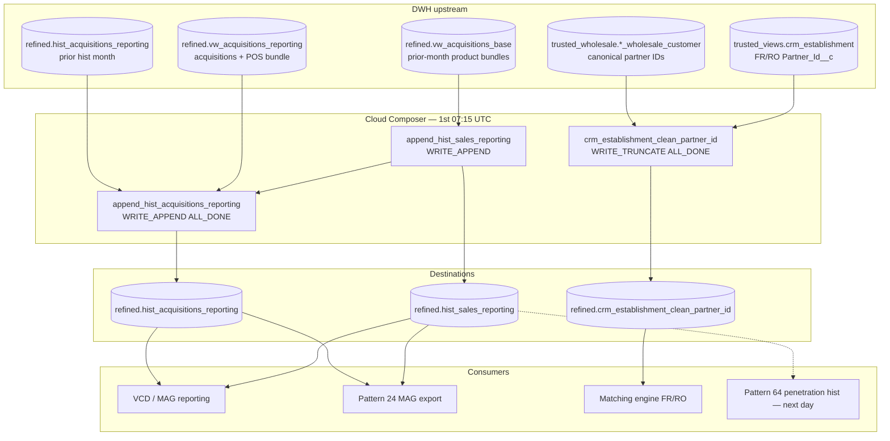

# Architecture: MAG sales / acquisitions monthly historization

Composer owns the 1st-of-month schedule, the sequential sales →
acquisitions chain, and the independent partner-ID truncate job.
BigQuery owns the prior-month filters, the cumulative join, and the
regex reconstruction of wholesale partner IDs.

## Diagram

## Components

**Calendar schedule (`15 7 1 * *`)**  
Runs on the 1st at 07:15 UTC. Reporting month is always the prior
calendar month via `DATE_SUB(DATE_TRUNC(CURRENT_DATE, MONTH), INTERVAL 1 MONTH)`.
Pattern 64 follows on the 2nd for penetration.

**Task 1 — sales hist**  
`WRITE_APPEND` of product-bundle counts (`suitePrem` / `suiteStart` /
`suiteOrd` / `suiteRes`) from the acquisitions base view.

**Task 2 — acquisitions hist**  
Full-outer join of current-month sales against the previous hist month's
`sales_all_time`, then append. Includes `suitePos`. Excludes `BE`.

**Task 3 — partner-ID clean (parallel)**  
No edge onto the MAG chain. Pattern-match free-text CRM IDs, rebuild
canonical numeric IDs with ISO country prefixes, validate against
wholesale customers, `WRITE_TRUNCATE` the clean table.

**ALL_DONE + retries=0**  
Production wiring. Acquisitions can schedule after a failed sales
append; retries are disabled to avoid silent double-writes.

## Boundaries

| Owns | Does not own |
|------|----------------|
| Month-grain append of sales / acquisitions hist | Penetration hist (pattern 64) |
| Cumulative `sales_all_time` carry-forward | Partner Avro export (pattern 24) |
| FR/RO partner-ID regex rebuild | Matching-engine SCD / scoring |
| 1st-of-month calendar relative to #64 | Daily refined zone spine |

## Operability notes

- `max_active_runs=1` added in the portfolio (production lacked it).
  Overlapping monthly runs would double-append hist tables.
- Partner-ID truncate is idempotent; MAG appends are not. Recover MAG
  by deleting `WHERE date = reporting_month` before re-run.
- Slot cost is modest (three queries). Correctness risk is the
  re-run path, not query cost.
