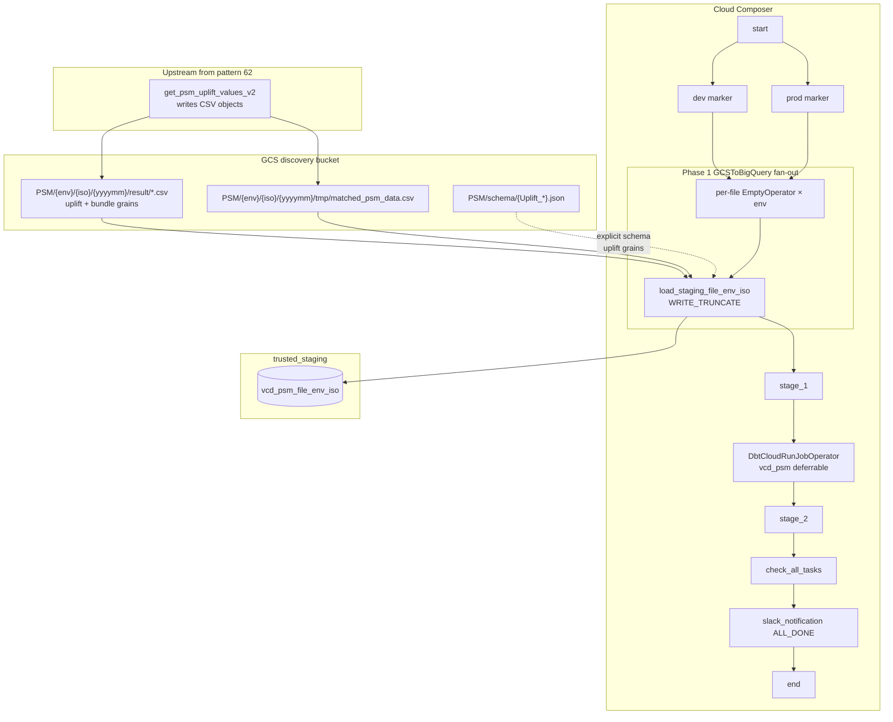

# Architecture: VCD PSM uplift CSV land

Composer owns schedule, the file × country × env fan-out, schema vs
autodetect selection, the sync barrier, the deferrable dbt Cloud job,
and run-status aggregation. GCS holds the SP-written CSV objects.
BigQuery staging holds WRITE_TRUNCATE land tables. dbt owns the
trusted_source / dashboard transform (the inline MERGE SQL is optional
reference only).

## Diagram

## Components

**Bi-monthly schedule (`15 10 3,8 * *`)**  
Same calendar as pattern 62, offset to 10:15 UTC so the SP window at
05:15 has time to write objects. Catchup off; `max_active_runs=1`.

**Dual-env markers**  
`start → [dev, prod]` then per-file EmptyOperators. Graph stays
readable when debugging one env without expanding every ISO load.

**Fan-out loads**  
For each of six files × ~13 ISOs × {dev, prod} (skip `global` for
`matched_psm_data`): `GCSToBigQueryOperator` with WRITE_TRUNCATE into
`trusted_staging.vcd_psm_{file}_{env}_{iso}`. Path uses `result/` for
uplift/bundle and `tmp/` for matched.

**Schema split**  
Uplift_per_* use `schema_object=PSM/schema/{file}.json`.
BundleQuarter, BundleFiscal, matched_psm_data use `autodetect=True`
plus `ignore_unknown_values` / `allow_quoted_newlines`.

**Barrier + dbt**  
All load chains join at `stage_1`, then a deferrable
`DbtCloudRunJobOperator` (`reuse_existing_run`, `retry_from_failure`,
60-minute hard timeout). `stage_2` separates transform from status.

**ALL_DONE status aggregation**  
`check_all_tasks` XComs sibling states; notification runs under
`ALL_DONE` and logs failed task ids. Portfolio stubs the webhook.

## Boundaries

| Owns | Does not own |
|------|----------------|
| GCS → staging CSV land fan-out | Calling `get_psm_uplift_values_v2` (pattern 62) |
| Schema vs autodetect policy | Body of the dbt VCD PSM models |
| Month Variable for object path | Looker / BI dashboard layer |
| Run-status aggregation | Writing the CSV objects themselves |

## Operability notes

- Missing object for one ISO fails that load task; barrier never opens
  for dbt — preferred over partial uplift on the dashboard.
- Re-run a prior month by setting Variable `vcd_psm_month=YYYYMM`
  before clearing failed tasks.
- Slot / load concurrency is the failure mode on DE/FR/PL nights when
  all envs land together; Composer pools are the next lever if needed.
