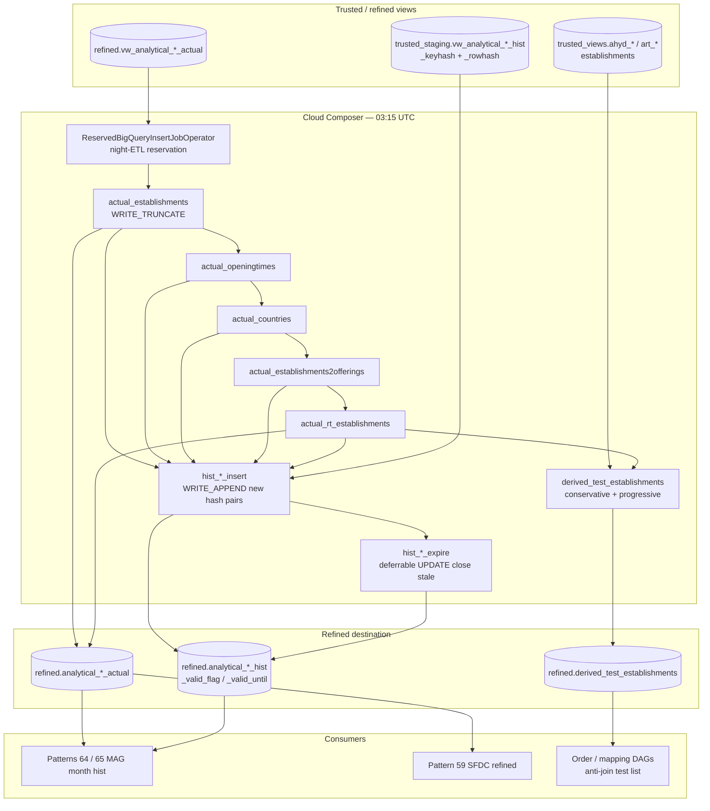

# Architecture: Daily refined-zone SCD spine

Composer owns the 03:15 schedule, the sequential actuals chain, and the
per-entity hist insert → expire branches. BigQuery owns the hash
comparison and the reservation-scoped slot assignment. Staging hist
views (`trusted_staging.vw_analytical_*_hist`) are assumed closed by
upstream trusted dbt before this DAG starts.

This folder is a **focused subset** of production `etl_refined_zone`
(~4.7k lines). The diagram shows the spine only.

## Diagram

## Components

**Schedule (`15 3 * * *`)**  
After trusted views settle, before midday POS refresh (#43) and partner
export windows. `dagrun_timeout=240m`, `max_active_runs=1`.

**ReservedBigQueryInsertJobOperator**  
Thin subclass that injects `configuration["reservation"]` from
Variable `bq_night_etl_reservation`. Same jobs, different slot pool —
analysts stay on-demand.

**Actuals chain**  
Sequential WRITE_TRUNCATE from `vw_analytical_*_actual` into
`analytical_*_actual`. Order matches production pressure control:
openingtimes → establishments → countries → establishments2offerings
→ rt_establishments.

**Hist insert**  
WRITE_APPEND rows from staging hist views whose
`CONCAT(_keyhash, _rowhash)` is not already current
(`_valid_flag = TRUE`) in the hist table.

**Hist expire (deferrable)**  
UPDATE current rows whose hash pair is missing from staging: set
`_valid_until` to end-of-yesterday and `_valid_flag = FALSE`. Deferral
keeps Composer workers free across many parallel expire jobs.

**Test establishments**  
UNION ALL of Hydra + Reservation Tool sources with two `type` labels.
Conservative for high-precision exclusion; progressive for broader
sandbox / QA noise. Destination:
`refined.derived_test_establishments`.

## Boundaries

| Owns | Does not own |
|------|----------------|
| Daily actuals + hash SCD2 hist spine | Full MCC / mapping / Order fan-out |
| Reservation pinning helper | Matching-engine SCD builders (#01) |
| Dual-mode test quarantine table | MAG month-grain hist (#64 / #65) |
| Insert-then-expire contract | Derived-events LAG append (#61) |

## Operability notes

- Staging hist views must include `_keyhash` and `_rowhash`. Without
  them this pattern collapses to full reload.
- Re-running a successful night without clearing hist is safe for
  insert (no new pairs) but expire is idempotent only if staging is
  unchanged — a mid-day staging rewrite before clear+rerun can close
  rows you still want current.
- Watch reservation utilization; if night jobs spill to on-demand the
  Variable is wrong or the reservation is undersized.
