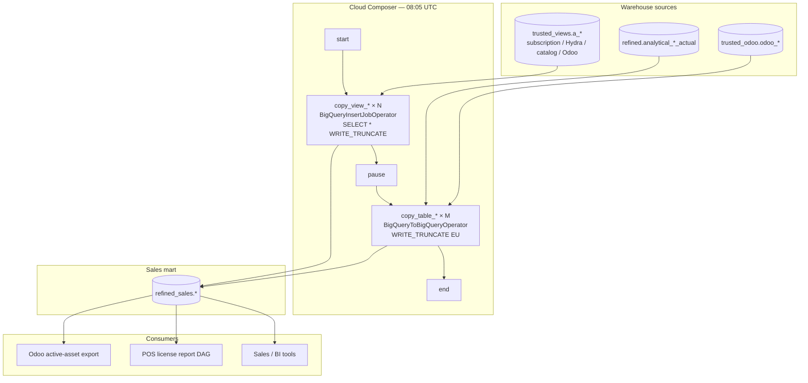

# Architecture: Sales data mart two-phase copy

Composer owns the 08:05 schedule, the object catalogs, and the phase
barrier. BigQuery owns the WRITE_TRUNCATE materializations. The mart
dataset (`refined_sales`) is the permission boundary — Sales IAM lands
there, not on `trusted` / `refined` wholesale.

## Diagram

## Components

**Schedule (`5 8 * * *`)**  
After overnight refined / trusted land (#67 spine and siblings), before
typical Sales dashboard refresh. `catchup=False`, `max_active_runs=1`.

**VIEW_CATALOG + InsertJob**  
Analytical views cannot be passed to `BigQueryToBigQueryOperator` as
sources. Phase 1 runs `SELECT * FROM project.dataset.view` into
`refined_sales.{view}` with WRITE_TRUNCATE. Destination project follows
ENV (sanitized fix — production hard-coded the prod project in DEV).

**PAUSE barrier**  
EmptyOperator between phases. Gives the previous fan-out time to release
slots before native table copies start. Not a substitute for
`max_active_tasks` under heavy slot contention.

**TABLE_CATALOG + BigQueryToBigQuery**  
Physical tables copy with `location='EU'`, CREATE_IF_NEEDED,
WRITE_TRUNCATE. Same names in the mart as in the source datasets —
consumers migrate by changing dataset, not renaming objects.

**chain() wiring**  
`chain(start, *view_tasks, pause, *table_tasks, end)` expands each list
as a parallel sibling group while keeping phase order. Adding an object
is a catalog append, not a graph rewrite.

**CRM freeze**  
Production commented out ~20 `asfdc_*` views and ~23 `sfdc_*` tables
after CRM decommission. Frozen copies remain in the mart; this pattern
ships only the live catalog. Re-enabling CRM objects is a catalog
change, not a new pattern.

## Operator choice summary

| Source type | Operator | Why |
|-------------|----------|-----|
| Analytical view | `BigQueryInsertJobOperator` | Materialize view → table |
| Physical table | `BigQueryToBigQueryOperator` | Native copy, no SQL parse |

## Failure surface

- One view failure does not cancel sibling views
  (`none_failed_min_one_success`), but pause still waits for the phase
  group semantics of `chain`.
- A failed table leaves that mart object on yesterday's truncate until
  clear + re-run.
- No row-count check — partial success can look "green" from a BI
  perspective until someone notices a stale object.
