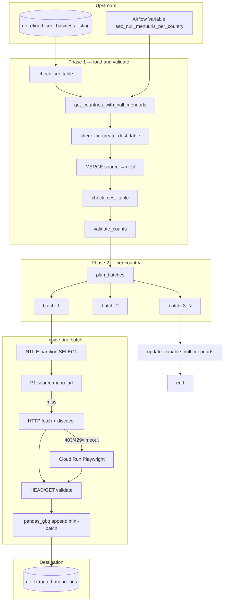

# Architecture: SEO menu URL extraction

Composer owns load/validate and country concurrency. The extractor
module owns fetch, discovery, validation, and append. Discovery is a
pure function of HTML — easy to unit-test without BQ.

## Diagram

## Components

**menu_url_utils**  
Single normalize path: resolve relative links, drop non-http(s), strip
fragments, strip query only when the path already looks like a menu.

**menu_url_discovery**  
Merge four HTML sources. JSON-LD only contributes when the graph
mentions HoReCa `@type`s; vocabulary IRIs and media extensions are
dropped. Anchors keep the old keyword behaviour so recall does not
regress when adding SPA / data-* paths.

**menu_url_extractor**  
NTILE slices of distinct websites (skip `_extraction_complete`).
ThreadPoolExecutor (5) with a shared requests Session. Deterministic
`menu_url_id` from SHA-256 of `(website, menu_url)` — no
`MAX(id)+1` races. Playwright is a Cloud Run POST with GCP identity
token, not an in-worker Chromium.

**DAG**  
Phase 1 MERGE uses `FARM_FINGERPRINT(establishment_id|website|menu_url)`
as the merge key and leaves extraction columns alone on match.
Countries chain sequentially; batches inside a country fan out under
`max_active_tasks=5`. Batch tasks use `ALL_DONE` so a failed plan still
lets empty batches no-op.

## Why NTILE instead of LIMIT/OFFSET?

Offset pagination drifts when the source grows mid-run and forces a
rescanning window. NTILE over ordered distinct URLs gives disjoint
slices that recompute from the same SQL. Combined with
`NOT EXISTS (... _extraction_complete)` the same batch id is safe to
re-run after a worker death.
