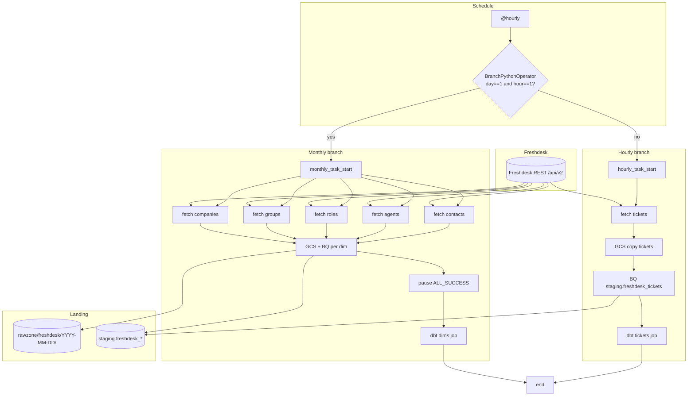

# Architecture: Freshdesk API ingest

Composer owns branching, GCS copy, BQ load, and dbt trigger. The
client module owns REST pagination and NDJSON shaping. Credentials
resolve inside task callables so DAG parse does not touch the API key.

## Diagram

## Components

**FreshdeskClient**  
Auth is HTTP basic with `(api_key, "X")` — Freshdesk's documented
pattern. Tickets add `updated_since` for the calendar month start.
Contacts/companies stringify `custom_fields`. Non-200 responses stop
the page loop; exceptions sleep briefly and re-raise so Airflow retries.

**BranchPythonOperator**  
Evaluates wall-clock day/hour at runtime. Only the matching branch
runs; the other is skipped. Source docstring disagreed with the check
— we document the code path (1st @ 01:00).

**Landing chain**  
Per resource: Python fetch → `GCSToGCSOperator` from Composer data
path → `GCSToBigQueryOperator` WRITE_TRUNCATE into
`staging.freshdesk_{resource}` with schema from
`schema_json/freshdesk_{resource}.json`.

**dbt**  
Tickets: one job after the hourly load (`dbt_freshdesk_tickets_job_id`).
Dims: one job after all monthly loads succeed
(`dbt_freshdesk_dims_job_id`). Hard-coded job IDs from source are
Variables here.

## Why branch instead of two DAGs?

Two DAGs sharing the same extract client inevitably diverge on
Variable names, bucket paths, and schema object locations. One DAG
with an explicit branch keeps the landing contract identical and makes
"did dims refresh this month?" a single run history to inspect.
